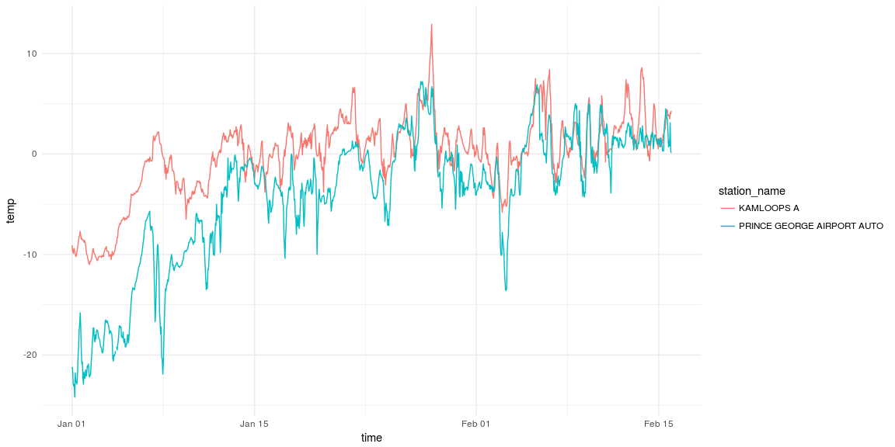

README
================
Steffi LaZerte

[](https://travis-ci.org/steffilazerte/envirocan) [](https://ci.appveyor.com/project/steffilazerte/envirocan)

envirocan
=========

This package is makes it easier to search for and download multiple months/years of historical weather data from Environment Canada website.

Bear in mind that these downloads can be fairly large and performing multiple, downloads may use up Environment Canada's bandwidth unecessarily. Try to stick to what you need.

Installation
------------

Use the `devtools` package to directly install R packages from github:

``` r
install.packages("devtools") # If not already installed
devtools::install_github("steffilazerte/envirocan", ref = "v0.2.2") 
## For most recent release; Otherwise omit "ref = " to download most recent version
## Also making use of the tidyverse for data manipulations
library(dplyr)
```

Basic usage:
------------

To download data, you first need to know the `station_id` associated with the station you're interested in.

### Stations

`envirocan` includes a data frame called `stations` which includes a list of stations and their details (including `station_id`.

``` r
glimpse(stations)
```

    ## Observations: 26,211
    ## Variables: 12
    ## $ prov         <fctr> BC, BC, BC, BC, BC, BC, BC, BC, BC, BC, BC, BC, ...
    ## $ station_name <chr> "ACTIVE PASS", "ALBERT HEAD", "BAMBERTON OCEAN CE...
    ## $ station_id   <fctr> 14, 15, 16, 17, 18, 19, 20, 21, 22, 25, 24, 23, ...
    ## $ climate_id   <fctr> 1010066, 1010235, 1010595, 1010720, 1010774, 101...
    ## $ WMO_id       <fctr> NA, NA, NA, NA, NA, NA, NA, NA, NA, NA, NA, NA, ...
    ## $ TC_id        <fctr> NA, NA, NA, NA, NA, NA, NA, NA, NA, NA, NA, NA, ...
    ## $ lat          <dbl> 48.87, 48.40, 48.58, 48.50, 48.50, 48.33, 48.60, ...
    ## $ lon          <dbl> -123.28, -123.48, -123.52, -124.00, -123.35, -123...
    ## $ elev         <dbl> 4.0, 17.0, 85.3, 350.5, 61.0, 12.2, 38.0, 30.5, 9...
    ## $ interval     <chr> "hour", "hour", "hour", "hour", "hour", "hour", "...
    ## $ start        <int> NA, NA, NA, NA, NA, NA, NA, NA, NA, NA, NA, NA, N...
    ## $ end          <int> NA, NA, NA, NA, NA, NA, NA, NA, NA, NA, NA, NA, N...

You can look through this data frame directly, or you can use the `stations_search` function:

``` r
stations_search("Kamloops", interval = "hour")
```

    ## # A tibble: 3 × 12
    ##     prov station_name station_id climate_id WMO_id  TC_id   lat     lon
    ##   <fctr>        <chr>     <fctr>     <fctr> <fctr> <fctr> <dbl>   <dbl>
    ## 1     BC   KAMLOOPS A       1275    1163780  71887    YKA  50.7 -120.44
    ## 2     BC   KAMLOOPS A      51423    1163781  71887    YKA  50.7 -120.45
    ## 3     BC KAMLOOPS AUT      42203    1163842  71741    ZKA  50.7 -120.44
    ## # ... with 4 more variables: elev <dbl>, interval <chr>, start <int>,
    ## #   end <int>

Time frame must be one of "hour", "day", or "month".

You can also search by proximity:

``` r
stations_search(coords = c(50.667492, -120.329049), dist = 20, interval = "hour")
```

    ## # A tibble: 3 × 13
    ##     prov station_name station_id climate_id WMO_id  TC_id   lat     lon
    ##   <fctr>        <chr>     <fctr>     <fctr> <fctr> <fctr> <dbl>   <dbl>
    ## 1     BC   KAMLOOPS A       1275    1163780  71887    YKA  50.7 -120.44
    ## 2     BC KAMLOOPS AUT      42203    1163842  71741    ZKA  50.7 -120.44
    ## 3     BC   KAMLOOPS A      51423    1163781  71887    YKA  50.7 -120.45
    ## # ... with 5 more variables: elev <dbl>, interval <chr>, start <int>,
    ## #   end <int>, distance <dbl>

We can also perform more complex searches using `tidyverse` tools and use the resulting vector:

``` r
BCstations <- stations %>%
  filter(prov %in% c("BC")) %>%
  filter(interval == "hour") %>%
  filter(lat > 49 & lat < 49.5) %>%
  filter(lon > -119 & lon < -116) %>%
  filter(start<=2002) %>%
  filter(end>=2016)

## weather() accepts numbers so we can create a vector to input into weather:
stn_vector <- BCstations$station_id 
```

### Weather

Once you have your `station_id`(s) you can download weather data:

``` r
kam <- weather(station_ids = 51423, start = "2016-01-01", end = "2016-02-15")
                    
kam
```

    ## # A tibble: 1,104 × 35
    ##    station_name station_id   prov   lat     lon       date
    ## *         <chr>      <dbl> <fctr> <dbl>   <dbl>     <date>
    ## 1    KAMLOOPS A      51423     BC  50.7 -120.45 2016-01-01
    ## 2    KAMLOOPS A      51423     BC  50.7 -120.45 2016-01-01
    ## 3    KAMLOOPS A      51423     BC  50.7 -120.45 2016-01-01
    ## 4    KAMLOOPS A      51423     BC  50.7 -120.45 2016-01-01
    ## 5    KAMLOOPS A      51423     BC  50.7 -120.45 2016-01-01
    ## 6    KAMLOOPS A      51423     BC  50.7 -120.45 2016-01-01
    ## 7    KAMLOOPS A      51423     BC  50.7 -120.45 2016-01-01
    ## 8    KAMLOOPS A      51423     BC  50.7 -120.45 2016-01-01
    ## 9    KAMLOOPS A      51423     BC  50.7 -120.45 2016-01-01
    ## 10   KAMLOOPS A      51423     BC  50.7 -120.45 2016-01-01
    ## # ... with 1,094 more rows, and 29 more variables: time <dttm>,
    ## #   year <chr>, month <chr>, day <chr>, hour <chr>, qual <chr>,
    ## #   weather <chr>, hmdx <dbl>, hmdx_flag <chr>, pressure <dbl>,
    ## #   pressure_flag <chr>, rel_hum <dbl>, rel_hum_flag <chr>, temp <dbl>,
    ## #   temp_dew <dbl>, temp_dew_flag <chr>, temp_flag <chr>, visib <dbl>,
    ## #   visib_flag <chr>, wind_chill <dbl>, wind_chill_flag <chr>,
    ## #   wind_dir <dbl>, wind_dir_flag <chr>, wind_spd <dbl>,
    ## #   wind_spd_flag <chr>, elev <dbl>, climat_id <chr>, WMO_id <chr>,
    ## #   TC_id <chr>

You can also download data from multiple stations at once:

``` r
kam.pg <- weather(station_ids = c(48248, 51423), start = "2016-01-01", end = "2016-02-15")
                    
kam.pg
```

    ## # A tibble: 2,208 × 35
    ##                  station_name station_id   prov   lat     lon       date
    ## *                       <chr>      <dbl> <fctr> <dbl>   <dbl>     <date>
    ## 1  PRINCE GEORGE AIRPORT AUTO      48248     BC 53.89 -122.67 2016-01-01
    ## 2  PRINCE GEORGE AIRPORT AUTO      48248     BC 53.89 -122.67 2016-01-01
    ## 3  PRINCE GEORGE AIRPORT AUTO      48248     BC 53.89 -122.67 2016-01-01
    ## 4  PRINCE GEORGE AIRPORT AUTO      48248     BC 53.89 -122.67 2016-01-01
    ## 5  PRINCE GEORGE AIRPORT AUTO      48248     BC 53.89 -122.67 2016-01-01
    ## 6  PRINCE GEORGE AIRPORT AUTO      48248     BC 53.89 -122.67 2016-01-01
    ## 7  PRINCE GEORGE AIRPORT AUTO      48248     BC 53.89 -122.67 2016-01-01
    ## 8  PRINCE GEORGE AIRPORT AUTO      48248     BC 53.89 -122.67 2016-01-01
    ## 9  PRINCE GEORGE AIRPORT AUTO      48248     BC 53.89 -122.67 2016-01-01
    ## 10 PRINCE GEORGE AIRPORT AUTO      48248     BC 53.89 -122.67 2016-01-01
    ## # ... with 2,198 more rows, and 29 more variables: time <dttm>,
    ## #   year <chr>, month <chr>, day <chr>, hour <chr>, qual <chr>,
    ## #   weather <chr>, hmdx <dbl>, hmdx_flag <chr>, pressure <dbl>,
    ## #   pressure_flag <chr>, rel_hum <dbl>, rel_hum_flag <chr>, temp <dbl>,
    ## #   temp_dew <dbl>, temp_dew_flag <chr>, temp_flag <chr>, visib <dbl>,
    ## #   visib_flag <chr>, wind_chill <dbl>, wind_chill_flag <chr>,
    ## #   wind_dir <dbl>, wind_dir_flag <chr>, wind_spd <dbl>,
    ## #   wind_spd_flag <chr>, elev <dbl>, climat_id <chr>, WMO_id <chr>,
    ## #   TC_id <chr>

And plot it:

``` r
library(ggplot2)

ggplot(data = kam.pg, aes(x = time, y = temp, group = station_name, colour = station_name)) +
  theme(legend.position = "top") +
  geom_line() +
  theme_minimal()
```



Or you can use the vector created above:

``` r
stn_vec_df <- weather(station_ids = stn_vector, start = "2016-01-01", end = "2016-02-15")

stn_vec_df
```

    ## # A tibble: 3,312 × 35
    ##    station_name station_id   prov   lat     lon       date
    ## *         <chr>      <chr> <fctr> <dbl>   <dbl>     <date>
    ## 1     NELSON CS       6839     BC 49.49 -117.31 2016-01-01
    ## 2     NELSON CS       6839     BC 49.49 -117.31 2016-01-01
    ## 3     NELSON CS       6839     BC 49.49 -117.31 2016-01-01
    ## 4     NELSON CS       6839     BC 49.49 -117.31 2016-01-01
    ## 5     NELSON CS       6839     BC 49.49 -117.31 2016-01-01
    ## 6     NELSON CS       6839     BC 49.49 -117.31 2016-01-01
    ## 7     NELSON CS       6839     BC 49.49 -117.31 2016-01-01
    ## 8     NELSON CS       6839     BC 49.49 -117.31 2016-01-01
    ## 9     NELSON CS       6839     BC 49.49 -117.31 2016-01-01
    ## 10    NELSON CS       6839     BC 49.49 -117.31 2016-01-01
    ## # ... with 3,302 more rows, and 29 more variables: time <dttm>,
    ## #   year <chr>, month <chr>, day <chr>, hour <chr>, qual <chr>,
    ## #   weather <chr>, hmdx <dbl>, hmdx_flag <chr>, pressure <dbl>,
    ## #   pressure_flag <chr>, rel_hum <dbl>, rel_hum_flag <chr>, temp <dbl>,
    ## #   temp_dew <dbl>, temp_dew_flag <chr>, temp_flag <chr>, visib <dbl>,
    ## #   visib_flag <chr>, wind_chill <dbl>, wind_chill_flag <chr>,
    ## #   wind_dir <dbl>, wind_dir_flag <chr>, wind_spd <dbl>,
    ## #   wind_spd_flag <chr>, elev <dbl>, climat_id <chr>, WMO_id <chr>,
    ## #   TC_id <chr>

### Interpolate and add data

You can merge weather data with other data frames by linearly interprolating between points.

For example, using the included datasets:

``` r
glimpse(kamloops)
```

    ## Observations: 4,368
    ## Variables: 35
    ## $ station_name    <chr> "KAMLOOPS A", "KAMLOOPS A", "KAMLOOPS A", "KAM...
    ## $ station_id      <dbl> 51423, 51423, 51423, 51423, 51423, 51423, 5142...
    ## $ prov            <fctr> BC, BC, BC, BC, BC, BC, BC, BC, BC, BC, BC, B...
    ## $ lat             <dbl> 50.7, 50.7, 50.7, 50.7, 50.7, 50.7, 50.7, 50.7...
    ## $ lon             <dbl> -120.45, -120.45, -120.45, -120.45, -120.45, -...
    ## $ date            <date> 2016-01-01, 2016-01-01, 2016-01-01, 2016-01-0...
    ## $ time            <dttm> 2016-01-01 00:00:00, 2016-01-01 01:00:00, 201...
    ## $ year            <chr> "2016", "2016", "2016", "2016", "2016", "2016"...
    ## $ month           <chr> "01", "01", "01", "01", "01", "01", "01", "01"...
    ## $ day             <chr> "01", "01", "01", "01", "01", "01", "01", "01"...
    ## $ hour            <chr> "00:00", "01:00", "02:00", "03:00", "04:00", "...
    ## $ qual            <chr> "Partner data that is not subject to review by...
    ## $ weather         <chr> NA, "Mostly Cloudy", NA, NA, "Cloudy", NA, NA,...
    ## $ hmdx            <dbl> NA, NA, NA, NA, NA, NA, NA, NA, NA, NA, NA, NA...
    ## $ hmdx_flag       <chr> "", "", "", "", "", "", "", "", "", "", "", ""...
    ## $ pressure        <dbl> 99.95, 99.93, 99.92, 99.90, 99.86, 99.82, 99.8...
    ## $ pressure_flag   <chr> "", "", "", "", "", "", "", "", "", "", "", ""...
    ## $ rel_hum         <dbl> 74, 76, 74, 73, 70, 71, 69, 69, 71, 71, 71, 70...
    ## $ rel_hum_flag    <chr> "", "", "", "", "", "", "", "", "", "", "", ""...
    ## $ temp            <dbl> -9.1, -9.6, -9.9, -9.5, -9.4, -9.8, -10.0, -10...
    ## $ temp_dew        <dbl> -12.9, -13.1, -13.7, -13.5, -13.9, -14.1, -14....
    ## $ temp_dew_flag   <chr> "", "", "", "", "", "", "", "", "", "", "", ""...
    ## $ temp_flag       <chr> "", "", "", "", "", "", "", "", "", "", "", ""...
    ## $ visib           <dbl> 64.4, 64.4, 64.4, 64.4, 64.4, 64.4, 64.4, 64.4...
    ## $ visib_flag      <chr> "", "", "", "", "", "", "", "", "", "", "", ""...
    ## $ wind_chill      <dbl> -17, -17, -18, -17, -17, -17, -18, -17, -17, -...
    ## $ wind_chill_flag <chr> "", "", "", "", "", "", "", "", "", "", "", ""...
    ## $ wind_dir        <dbl> 13, 11, 11, 11, 11, 10, 9, 7, 7, 10, 11, 10, 1...
    ## $ wind_dir_flag   <chr> "", "", "", "", "", "", "", "", "", "", "", ""...
    ## $ wind_spd        <dbl> 19, 20, 20, 18, 18, 16, 23, 15, 14, 15, 12, 11...
    ## $ wind_spd_flag   <chr> "", "", "", "", "", "", "", "", "", "", "", ""...
    ## $ elev            <dbl> 345.3, 345.3, 345.3, 345.3, 345.3, 345.3, 345....
    ## $ climat_id       <chr> "1163781", "1163781", "1163781", "1163781", "1...
    ## $ WMO_id          <chr> "71887", "71887", "71887", "71887", "71887", "...
    ## $ TC_id           <chr> "YKA", "YKA", "YKA", "YKA", "YKA", "YKA", "YKA...

``` r
glimpse(finches)
```

    ## Observations: 16,595
    ## Variables: 6
    ## $ bird_id   <fctr> 041868D861, 041868D861, 041868D861, 041868D861, 041...
    ## $ time      <dttm> 2016-02-29 07:40:15, 2016-02-29 07:40:19, 2016-02-2...
    ## $ feeder_id <fctr> 2200, 2200, 2200, 2200, 2200, 2200, 2200, 2200, 220...
    ## $ species   <chr> "House Finch", "House Finch", "House Finch", "House ...
    ## $ lon       <dbl> -120.3612, -120.3612, -120.3612, -120.3612, -120.361...
    ## $ lat       <dbl> 50.66778, 50.66778, 50.66778, 50.66778, 50.66778, 50...

``` r
finches_temperature <- add_weather(data = finches, weather = kamloops, cols = "temp")
```

    ## temp is missing 4 out of 4368 data, interpolation may be less accurate as a result.

``` r
summary(finches_temperature)
```

    ##        bird_id          time                     feeder_id  
    ##  0620000513:7536   Min.   :2016-02-29 07:40:15   1500:6351  
    ##  041868D861:2593   1st Qu.:2016-03-05 10:43:39   2100:1037  
    ##  0620000514:1759   Median :2016-03-09 13:39:34   2200:2297  
    ##  06200004F8:1400   Mean   :2016-03-08 22:31:28   2300:3448  
    ##  041868BED6: 888   3rd Qu.:2016-03-12 14:57:16   2400:1434  
    ##  06200003BB: 719   Max.   :2016-03-15 17:52:39   2700:2028  
    ##  (Other)   :1700                                            
    ##    species               lon              lat             temp       
    ##  Length:16595       Min.   :-120.4   Min.   :50.67   Min.   :-1.763  
    ##  Class :character   1st Qu.:-120.4   1st Qu.:50.67   1st Qu.: 5.353  
    ##  Mode  :character   Median :-120.4   Median :50.67   Median : 9.076  
    ##                     Mean   :-120.4   Mean   :50.67   Mean   : 8.688  
    ##                     3rd Qu.:-120.4   3rd Qu.:50.67   3rd Qu.:11.963  
    ##                     Max.   :-120.4   Max.   :50.67   Max.   :16.353  
    ## 

``` r
glimpse(finches_temperature)
```

    ## Observations: 16,595
    ## Variables: 7
    ## $ bird_id   <fctr> 041868D861, 041868D861, 041868D861, 041868D861, 041...
    ## $ time      <dttm> 2016-02-29 07:40:15, 2016-02-29 07:40:19, 2016-02-2...
    ## $ feeder_id <fctr> 2200, 2200, 2200, 2200, 2200, 2200, 2200, 2200, 220...
    ## $ species   <chr> "House Finch", "House Finch", "House Finch", "House ...
    ## $ lon       <dbl> -120.3612, -120.3612, -120.3612, -120.3612, -120.361...
    ## $ lat       <dbl> 50.66778, 50.66778, 50.66778, 50.66778, 50.66778, 50...
    ## $ temp      <dbl> 1.726667, 1.724889, 1.723556, 1.719556, 1.718222, 1....

By default, gaps of 2 hours (or two days, with a daily scale) will be interpolated over, but longer gaps will be filled with NAs. You can adjust this behaviour with `na_gap`. Note that as environment canada data is downloaded on an hourly scale, it makes no sense to apply `na_gap` values of less than 1.

``` r
finches_temperature <- add_weather(data = finches, weather = kamloops, cols = "temp", na_gap = 1)
```

    ## temp is missing 4 out of 4368 data, interpolation may be less accurate as a result.

``` r
summary(finches_temperature)
```

    ##        bird_id          time                     feeder_id  
    ##  0620000513:7536   Min.   :2016-02-29 07:40:15   1500:6351  
    ##  041868D861:2593   1st Qu.:2016-03-05 10:43:39   2100:1037  
    ##  0620000514:1759   Median :2016-03-09 13:39:34   2200:2297  
    ##  06200004F8:1400   Mean   :2016-03-08 22:31:28   2300:3448  
    ##  041868BED6: 888   3rd Qu.:2016-03-12 14:57:16   2400:1434  
    ##  06200003BB: 719   Max.   :2016-03-15 17:52:39   2700:2028  
    ##  (Other)   :1700                                            
    ##    species               lon              lat             temp       
    ##  Length:16595       Min.   :-120.4   Min.   :50.67   Min.   :-1.763  
    ##  Class :character   1st Qu.:-120.4   1st Qu.:50.67   1st Qu.: 5.288  
    ##  Mode  :character   Median :-120.4   Median :50.67   Median : 9.078  
    ##                     Mean   :-120.4   Mean   :50.67   Mean   : 8.682  
    ##                     3rd Qu.:-120.4   3rd Qu.:50.67   3rd Qu.:11.972  
    ##                     Max.   :-120.4   Max.   :50.67   Max.   :16.353  
    ##                                                      NA's   :195

``` r
finches_temperature[is.na(finches_temperature$temp),][1:10,]
```

    ##         bird_id                time feeder_id     species       lon
    ## 7443 062000035D 2016-03-08 12:10:10      1500 House Finch -120.3658
    ## 7444 062000035D 2016-03-08 12:10:11      1500 House Finch -120.3658
    ## 7445 062000035D 2016-03-08 12:10:13      1500 House Finch -120.3658
    ## 7446 062000035D 2016-03-08 12:10:14      1500 House Finch -120.3658
    ## 7447 06200004F8 2016-03-08 12:12:26      1500 House Finch -120.3658
    ## 7448 06200004F8 2016-03-08 12:12:28      1500 House Finch -120.3658
    ## 7449 06200004F8 2016-03-08 12:12:29      1500 House Finch -120.3658
    ## 7450 06200004F8 2016-03-08 12:12:30      1500 House Finch -120.3658
    ## 7451 06200004F8 2016-03-08 12:12:32      1500 House Finch -120.3658
    ## 7452 06200004F8 2016-03-08 12:12:33      1500 House Finch -120.3658
    ##           lat temp
    ## 7443 50.67057   NA
    ## 7444 50.67057   NA
    ## 7445 50.67057   NA
    ## 7446 50.67057   NA
    ## 7447 50.67057   NA
    ## 7448 50.67057   NA
    ## 7449 50.67057   NA
    ## 7450 50.67057   NA
    ## 7451 50.67057   NA
    ## 7452 50.67057   NA

``` r
kamloops[is.na(kamloops$temp), c("time", "temp")]
```

    ##                     time temp
    ## 1004 2016-02-11 19:00:00   NA
    ## 1622 2016-03-08 13:00:00   NA
    ## 1682 2016-03-11 01:00:00   NA
    ## 2377 2016-04-09 00:00:00   NA
