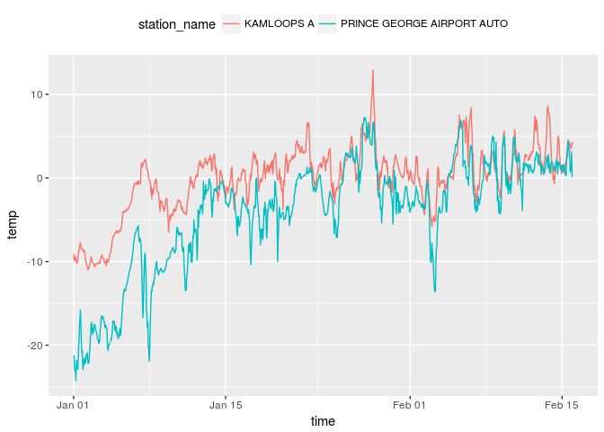

envirocan
=========

This package is makes it easier to search for and download multiple
months/years of historical weather data from Environment Canada webiste.

Installation
------------

Use the `devtools` package to directly install R packages from github:

    install.packages("devtools") # If not already installed
    devtools::install_github("steffilazerte/envirocan", ref = "v0.1.1.1") 
    ## For most recent release; Otherwise omit "ref = " to download most recent version

Basic usage:
------------

To download data, you first need to know the `station_id` associated
with the station you're interested in.

### Stations

`envirocan` includes a data frame called `stations` which includes a
list of stations and their details (including `station_id`.

    head(stations)

    ##   prov           station_name station_id climate_id WMO_id TC_id   lat
    ## 1   BC            ACTIVE PASS         14    1010066   <NA>  <NA> 48.87
    ## 2   BC            ALBERT HEAD         15    1010235   <NA>  <NA> 48.40
    ## 3   BC BAMBERTON OCEAN CEMENT         16    1010595   <NA>  <NA> 48.58
    ## 4   BC             BEAR CREEK         17    1010720   <NA>  <NA> 48.50
    ## 5   BC            BEAVER LAKE         18    1010774   <NA>  <NA> 48.50
    ## 6   BC             BECHER BAY         19    1010780   <NA>  <NA> 48.33
    ##       lon  elev timeframe start end
    ## 1 -123.28   4.0      hour    NA  NA
    ## 2 -123.48  17.0      hour    NA  NA
    ## 3 -123.52  85.3      hour    NA  NA
    ## 4 -124.00 350.5      hour    NA  NA
    ## 5 -123.35  61.0      hour    NA  NA
    ## 6 -123.63  12.2      hour    NA  NA

You can look through this data frame directly, or you can use the
`stations_search` function:

    stations_search("Kamloops", timeframe = "hour")

    ##   prov station_name station_id climate_id WMO_id TC_id  lat     lon  elev
    ## 1   BC   KAMLOOPS A       1275    1163780  71887   YKA 50.7 -120.44 345.3
    ## 2   BC   KAMLOOPS A      51423    1163781  71887   YKA 50.7 -120.45 345.3
    ## 3   BC KAMLOOPS AUT      42203    1163842  71741   ZKA 50.7 -120.44 345.0
    ##   timeframe start  end
    ## 1      hour  1953 2013
    ## 2      hour  2013 2016
    ## 3      hour  2006 2016

Time frame must be one of "hour", "day", or "month".

You can also search by proximity:

    stations_search(coords = c(50.667492, -120.329049), dist = 20, timeframe = "hour")

    ##   prov station_name station_id climate_id WMO_id TC_id  lat     lon  elev
    ## 1   BC   KAMLOOPS A       1275    1163780  71887   YKA 50.7 -120.44 345.3
    ## 2   BC KAMLOOPS AUT      42203    1163842  71741   ZKA 50.7 -120.44 345.0
    ## 3   BC   KAMLOOPS A      51423    1163781  71887   YKA 50.7 -120.45 345.3
    ##   timeframe start  end distance
    ## 1      hour  1953 2013 8.634000
    ## 2      hour  2006 2016 8.634000
    ## 3      hour  2013 2016 9.280565

### Weather

Once you have your `station_id`(s) you can download weather data:

    kamloops <- weather(station_ids = 51423,
                        start = "2016-01-01", end = "2016-02-15")
                        
    head(kamloops)

    ##   station_name station_id prov  lat     lon       date                time
    ## 1   KAMLOOPS A      51423   BC 50.7 -120.45 2016-01-01 2016-01-01 00:00:00
    ## 2   KAMLOOPS A      51423   BC 50.7 -120.45 2016-01-01 2016-01-01 01:00:00
    ## 3   KAMLOOPS A      51423   BC 50.7 -120.45 2016-01-01 2016-01-01 02:00:00
    ## 4   KAMLOOPS A      51423   BC 50.7 -120.45 2016-01-01 2016-01-01 03:00:00
    ## 5   KAMLOOPS A      51423   BC 50.7 -120.45 2016-01-01 2016-01-01 04:00:00
    ## 6   KAMLOOPS A      51423   BC 50.7 -120.45 2016-01-01 2016-01-01 05:00:00
    ##   year month day  hour
    ## 1 2016    01  01 00:00
    ## 2 2016    01  01 01:00
    ## 3 2016    01  01 02:00
    ## 4 2016    01  01 03:00
    ## 5 2016    01  01 04:00
    ## 6 2016    01  01 05:00
    ##                                                                          qual
    ## 1 Partner data that is not subject to review by the National Climate Archives
    ## 2 Partner data that is not subject to review by the National Climate Archives
    ## 3 Partner data that is not subject to review by the National Climate Archives
    ## 4 Partner data that is not subject to review by the National Climate Archives
    ## 5 Partner data that is not subject to review by the National Climate Archives
    ## 6 Partner data that is not subject to review by the National Climate Archives
    ##         weather hmdx hmdx_flag pressure pressure_flag rel_hum rel_hum_flag
    ## 1          <NA>   NA              99.95                    74             
    ## 2 Mostly Cloudy   NA              99.93                    76             
    ## 3          <NA>   NA              99.92                    74             
    ## 4          <NA>   NA              99.90                    73             
    ## 5        Cloudy   NA              99.86                    70             
    ## 6          <NA>   NA              99.82                    71             
    ##   temp temp_dew temp_dew_flag temp_flag visib visib_flag wind_chill
    ## 1 -9.1    -12.9                          64.4                   -17
    ## 2 -9.6    -13.1                          64.4                   -17
    ## 3 -9.9    -13.7                          64.4                   -18
    ## 4 -9.5    -13.5                          64.4                   -17
    ## 5 -9.4    -13.9                          64.4                   -17
    ## 6 -9.8    -14.1                          64.4                   -17
    ##   wind_chill_flag wind_dir wind_dir_flag wind_spd wind_spd_flag  elev
    ## 1                       13                     19               345.3
    ## 2                       11                     20               345.3
    ## 3                       11                     20               345.3
    ## 4                       11                     18               345.3
    ## 5                       11                     18               345.3
    ## 6                       10                     16               345.3
    ##   climat_id WMO_id TC_id
    ## 1   1163781  71887   YKA
    ## 2   1163781  71887   YKA
    ## 3   1163781  71887   YKA
    ## 4   1163781  71887   YKA
    ## 5   1163781  71887   YKA
    ## 6   1163781  71887   YKA

You can also download data from multiple stations at once:

    kam.pg <- weather(station_ids = c(48248, 51423),
                      start = "2016-01-01", end = "2016-02-15")
                        
    head(kam.pg)

    ##                 station_name station_id prov   lat     lon       date
    ## 1 PRINCE GEORGE AIRPORT AUTO      48248   BC 53.89 -122.67 2016-01-01
    ## 2 PRINCE GEORGE AIRPORT AUTO      48248   BC 53.89 -122.67 2016-01-01
    ## 3 PRINCE GEORGE AIRPORT AUTO      48248   BC 53.89 -122.67 2016-01-01
    ## 4 PRINCE GEORGE AIRPORT AUTO      48248   BC 53.89 -122.67 2016-01-01
    ## 5 PRINCE GEORGE AIRPORT AUTO      48248   BC 53.89 -122.67 2016-01-01
    ## 6 PRINCE GEORGE AIRPORT AUTO      48248   BC 53.89 -122.67 2016-01-01
    ##                  time year month day  hour qual weather hmdx hmdx_flag
    ## 1 2016-01-01 00:00:00 2016    01  01 00:00         <NA>   NA          
    ## 2 2016-01-01 01:00:00 2016    01  01 01:00         <NA>   NA          
    ## 3 2016-01-01 02:00:00 2016    01  01 02:00         <NA>   NA          
    ## 4 2016-01-01 03:00:00 2016    01  01 03:00         <NA>   NA          
    ## 5 2016-01-01 04:00:00 2016    01  01 04:00         <NA>   NA          
    ## 6 2016-01-01 05:00:00 2016    01  01 05:00         <NA>   NA          
    ##   pressure pressure_flag rel_hum rel_hum_flag  temp temp_dew temp_dew_flag
    ## 1    95.26                    79              -21.2    -23.9              
    ## 2    95.23                    81              -21.4    -23.8              
    ## 3    95.22                    79              -22.8    -25.5              
    ## 4    95.22                    79              -23.1    -25.8              
    ## 5    95.17                    79              -22.9    -25.6              
    ## 6    95.14                    78              -24.2    -26.9              
    ##   temp_flag visib visib_flag wind_chill wind_chill_flag wind_dir
    ## 1              NA                   -24                       35
    ## 2              NA                   -23                        3
    ## 3              NA                   -25                       33
    ## 4              NA                   -24                        0
    ## 5              NA                   -24                       32
    ## 6              NA                   -27                       34
    ##   wind_dir_flag wind_spd wind_spd_flag elev climat_id WMO_id TC_id
    ## 1                      3                680   1096453  71302   VXS
    ## 2                      2                680   1096453  71302   VXS
    ## 3                      2                680   1096453  71302   VXS
    ## 4                      1                680   1096453  71302   VXS
    ## 5                      1                680   1096453  71302   VXS
    ## 6                      3                680   1096453  71302   VXS

And plot it:

    library(ggplot2)

    ggplot(data = kam.pg, aes(x = time, y = temp, group = station_name, colour = station_name)) +
      theme(legend.position = "top") +
      geom_line()

<!-- -->
