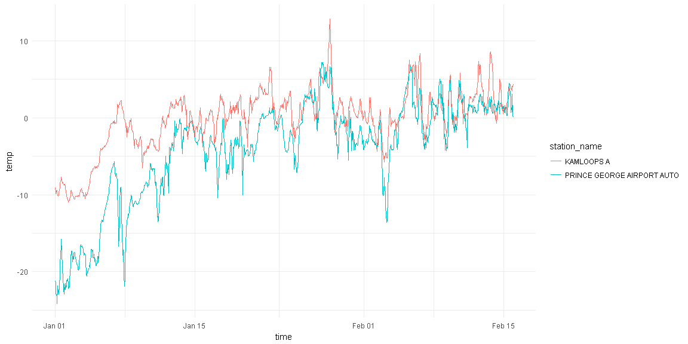

weathercan 
==========================================================================================================================================

[](https://travis-ci.org/steffilazerte/weathercan) [](https://ci.appveyor.com/project/steffilazerte/weathercan) [](https://codecov.io/gh/steffilazerte/weathercan) [](https://github.com/ropensci/onboarding/issues/160)

This package is makes it easier to search for and download multiple months/years of historical weather data from [Environment and Climate Change Canada (ECCC) website](http://climate.weather.gc.ca/historical_data/search_historic_data_e.html).

Bear in mind that these downloads can be fairly large and performing multiple downloads may use up ECCC's bandwidth unecessarily. Try to stick to what you need.

For more details and tutorials checkout the [weathercan website](http://steffilazerte.github.io/weathercan)

Installation
------------

Use the `devtools` package to directly install R packages from github:

``` r
install.packages("devtools") # If not already installed
devtools::install_github("steffilazerte/weathercan") 
```

General usage
-------------

To download data, you first need to know the `station_id` associated with the station you're interested in.

### Stations

`weathercan` includes a data frame called `stations` which includes a list of stations and their details (including `station_id`.

``` r
head(stations)
```

    ## # A tibble: 6 x 12
    ##     prov           station_name station_id climate_id WMO_id  TC_id   lat     lon  elev interval
    ##   <fctr>                  <chr>     <fctr>     <fctr> <fctr> <fctr> <dbl>   <dbl> <dbl>    <chr>
    ## 1     BC            ACTIVE PASS         14    1010066   <NA>   <NA> 48.87 -123.28   4.0     hour
    ## 2     BC            ALBERT HEAD         15    1010235   <NA>   <NA> 48.40 -123.48  17.0     hour
    ## 3     BC BAMBERTON OCEAN CEMENT         16    1010595   <NA>   <NA> 48.58 -123.52  85.3     hour
    ## 4     BC             BEAR CREEK         17    1010720   <NA>   <NA> 48.50 -124.00 350.5     hour
    ## 5     BC            BEAVER LAKE         18    1010774   <NA>   <NA> 48.50 -123.35  61.0     hour
    ## 6     BC             BECHER BAY         19    1010780   <NA>   <NA> 48.33 -123.63  12.2     hour
    ## # ... with 2 more variables: start <int>, end <int>

``` r
glimpse(stations)
```

    ## Observations: 26,217
    ## Variables: 12
    ## $ prov         <fctr> BC, BC, BC, BC, BC, BC, BC, BC, BC, BC, BC, BC, BC, BC, BC, BC, BC, BC, B...
    ## $ station_name <chr> "ACTIVE PASS", "ALBERT HEAD", "BAMBERTON OCEAN CEMENT", "BEAR CREEK", "BEA...
    ## $ station_id   <fctr> 14, 15, 16, 17, 18, 19, 20, 21, 22, 25, 24, 23, 26, 27, 28, 29, 30, 31, 3...
    ## $ climate_id   <fctr> 1010066, 1010235, 1010595, 1010720, 1010774, 1010780, 1010960, 1010961, 1...
    ## $ WMO_id       <fctr> NA, NA, NA, NA, NA, NA, NA, NA, NA, NA, NA, NA, NA, NA, NA, NA, NA, NA, N...
    ## $ TC_id        <fctr> NA, NA, NA, NA, NA, NA, NA, NA, NA, NA, NA, NA, NA, NA, NA, NA, NA, NA, N...
    ## $ lat          <dbl> 48.87, 48.40, 48.58, 48.50, 48.50, 48.33, 48.60, 48.57, 48.57, 48.58, 48.5...
    ## $ lon          <dbl> -123.28, -123.48, -123.52, -124.00, -123.35, -123.63, -123.47, -123.45, -1...
    ## $ elev         <dbl> 4.00, 17.00, 85.30, 350.50, 61.00, 12.20, 38.00, 30.50, 91.40, 53.30, 38.0...
    ## $ interval     <chr> "hour", "hour", "hour", "hour", "hour", "hour", "hour", "hour", "hour", "h...
    ## $ start        <int> NA, NA, NA, NA, NA, NA, NA, NA, NA, NA, NA, NA, NA, NA, NA, NA, NA, NA, NA...
    ## $ end          <int> NA, NA, NA, NA, NA, NA, NA, NA, NA, NA, NA, NA, NA, NA, NA, NA, NA, NA, NA...

You can look through this data frame directly, or you can use the `stations_search` function:

``` r
stations_search("Kamloops", interval = "hour")
```

    ## # A tibble: 3 x 12
    ##     prov station_name station_id climate_id WMO_id  TC_id   lat     lon  elev interval start   end
    ##   <fctr>        <chr>     <fctr>     <fctr> <fctr> <fctr> <dbl>   <dbl> <dbl>    <chr> <int> <int>
    ## 1     BC   KAMLOOPS A       1275    1163780  71887    YKA  50.7 -120.44 345.3     hour  1953  2013
    ## 2     BC   KAMLOOPS A      51423    1163781  71887    YKA  50.7 -120.45 345.3     hour  2013  2017
    ## 3     BC KAMLOOPS AUT      42203    1163842  71741    ZKA  50.7 -120.44 345.0     hour  2006  2017

Time frame must be one of "hour", "day", or "month".

You can also search by proximity:

``` r
stations_search(coords = c(50.667492, -120.329049), dist = 20, interval = "hour")
```

    ## # A tibble: 3 x 13
    ##     prov station_name station_id climate_id WMO_id  TC_id   lat     lon  elev interval start   end
    ##   <fctr>        <chr>     <fctr>     <fctr> <fctr> <fctr> <dbl>   <dbl> <dbl>    <chr> <int> <int>
    ## 1     BC   KAMLOOPS A       1275    1163780  71887    YKA  50.7 -120.44 345.3     hour  1953  2013
    ## 2     BC KAMLOOPS AUT      42203    1163842  71741    ZKA  50.7 -120.44 345.0     hour  2006  2017
    ## 3     BC   KAMLOOPS A      51423    1163781  71887    YKA  50.7 -120.45 345.3     hour  2013  2017
    ## # ... with 1 more variables: distance <dbl>

### Weather

Once you have your `station_id`(s) you can download weather data:

``` r
kam <- weather(station_ids = 51423, start = "2016-01-01", end = "2016-02-15")
```

    ## Warning: All formats failed to parse. No formats found.

    ## Warning: All formats failed to parse. No formats found.

``` r
kam
```

    ## # A tibble: 1,104 x 35
    ##    station_name station_id   prov   lat     lon       date                time  year month   day
    ##  *        <chr>      <dbl> <fctr> <dbl>   <dbl>     <date>              <dttm> <chr> <chr> <chr>
    ##  1   KAMLOOPS A      51423     BC  50.7 -120.45 2016-01-01 2016-01-01 00:00:00  2016    01    01
    ##  2   KAMLOOPS A      51423     BC  50.7 -120.45 2016-01-01 2016-01-01 01:00:00  2016    01    01
    ##  3   KAMLOOPS A      51423     BC  50.7 -120.45 2016-01-01 2016-01-01 02:00:00  2016    01    01
    ##  4   KAMLOOPS A      51423     BC  50.7 -120.45 2016-01-01 2016-01-01 03:00:00  2016    01    01
    ##  5   KAMLOOPS A      51423     BC  50.7 -120.45 2016-01-01 2016-01-01 04:00:00  2016    01    01
    ##  6   KAMLOOPS A      51423     BC  50.7 -120.45 2016-01-01 2016-01-01 05:00:00  2016    01    01
    ##  7   KAMLOOPS A      51423     BC  50.7 -120.45 2016-01-01 2016-01-01 06:00:00  2016    01    01
    ##  8   KAMLOOPS A      51423     BC  50.7 -120.45 2016-01-01 2016-01-01 07:00:00  2016    01    01
    ##  9   KAMLOOPS A      51423     BC  50.7 -120.45 2016-01-01 2016-01-01 08:00:00  2016    01    01
    ## 10   KAMLOOPS A      51423     BC  50.7 -120.45 2016-01-01 2016-01-01 09:00:00  2016    01    01
    ## # ... with 1,094 more rows, and 25 more variables

You can also download data from multiple stations at once:

``` r
kam_pg <- weather(station_ids = c(48248, 51423), start = "2016-01-01", end = "2016-02-15")
```

    ## Warning: All formats failed to parse. No formats found.

    ## Warning: All formats failed to parse. No formats found.

    ## Warning: All formats failed to parse. No formats found.

    ## Warning: All formats failed to parse. No formats found.

``` r
kam_pg
```

    ## # A tibble: 2,208 x 35
    ##                  station_name station_id   prov   lat     lon       date                time  year
    ##  *                      <chr>      <dbl> <fctr> <dbl>   <dbl>     <date>              <dttm> <chr>
    ##  1 PRINCE GEORGE AIRPORT AUTO      48248     BC 53.89 -122.67 2016-01-01 2016-01-01 00:00:00  2016
    ##  2 PRINCE GEORGE AIRPORT AUTO      48248     BC 53.89 -122.67 2016-01-01 2016-01-01 01:00:00  2016
    ##  3 PRINCE GEORGE AIRPORT AUTO      48248     BC 53.89 -122.67 2016-01-01 2016-01-01 02:00:00  2016
    ##  4 PRINCE GEORGE AIRPORT AUTO      48248     BC 53.89 -122.67 2016-01-01 2016-01-01 03:00:00  2016
    ##  5 PRINCE GEORGE AIRPORT AUTO      48248     BC 53.89 -122.67 2016-01-01 2016-01-01 04:00:00  2016
    ##  6 PRINCE GEORGE AIRPORT AUTO      48248     BC 53.89 -122.67 2016-01-01 2016-01-01 05:00:00  2016
    ##  7 PRINCE GEORGE AIRPORT AUTO      48248     BC 53.89 -122.67 2016-01-01 2016-01-01 06:00:00  2016
    ##  8 PRINCE GEORGE AIRPORT AUTO      48248     BC 53.89 -122.67 2016-01-01 2016-01-01 07:00:00  2016
    ##  9 PRINCE GEORGE AIRPORT AUTO      48248     BC 53.89 -122.67 2016-01-01 2016-01-01 08:00:00  2016
    ## 10 PRINCE GEORGE AIRPORT AUTO      48248     BC 53.89 -122.67 2016-01-01 2016-01-01 09:00:00  2016
    ## # ... with 2,198 more rows, and 27 more variables

And plot it:

``` r
library(ggplot2)

ggplot(data = kam_pg, aes(x = time, y = temp, group = station_name, colour = station_name)) +
  theme_minimal() + 
  geom_line()
```



Citation
========

``` r
citation("weathercan")
```

    ## 
    ## To cite package 'weathercan' in publications use:
    ## 
    ##   Steffi LaZerte (2017). weathercan: Download Weather Data from the Environment and
    ##   Climate Change Canada Website. R package version 0.2.2.9000.
    ##   https://github.com/steffilazerte/weathercan
    ## 
    ## A BibTeX entry for LaTeX users is
    ## 
    ##   @Manual{,
    ##     title = {weathercan: Download Weather Data from the Environment and Climate Change Canada Website},
    ##     author = {Steffi LaZerte},
    ##     year = {2017},
    ##     note = {R package version 0.2.2.9000},
    ##     url = {https://github.com/steffilazerte/weathercan},
    ##   }

License
=======

The data and the code in this repository are licensed under multiple licences. All code is licensed [GPL-3](https://www.gnu.org/licenses/gpl-3.0.en.html). All weather data is licensed under the ([Open Government License - Canada](http://open.canada.ca/en/open-government-licence-canada)).

Code of Conduct
===============

Please note that this project is released with a [Contributor Code of Conduct](CONDUCT.md). By participating in this project you agree to abide by its terms.
