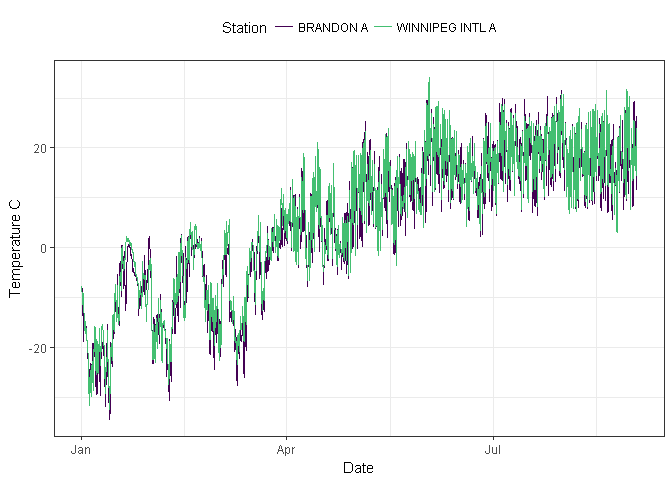

# Summary

Environment and Climate Change Canada maintains an online source of historical Canadian weather data in hourly, daily and monthly formats for various stations across Canada [@canada_historical_2011]. This data is freely available and can be accessed directly from their website. However, downloading data from multiple stations and across larger time periods can take significant time and effort. Further, these downloads require processing before they can be used for analysis. `weathercan` [@lazerte_weathercan:_2017] is an R package that automates and simplifies the downloading and formating of this data.

The first step in using `weathercan` is to identify the `station_id`(s) of the weather station(s) of interest. Stations can be searched for either by name (e.g., `stations_search("Brandon")`) or proximity to a given location (e.g., `stations_search(coords = c(49.84847, -99.95009))`). Searches can be conducted on all possible stations, or filtered to include only those recording weather at the desired time interval:

``` {.r}
library(weathercan)
stations_search("Brandon", interval = "hour")
```

    ## # A tibble: 3 x 12
    ##     prov station_name station_id climate_id WMO_id  TC_id   lat    lon  elev interval
    ##   <fctr>        <chr>     <fctr>     <fctr> <fctr> <fctr> <dbl>  <dbl> <dbl>    <chr>
    ## 1     MB    BRANDON A       3471    5010480  71140    YBR 49.91 -99.95 409.4     hour
    ## 2     MB    BRANDON A      50821    5010481  71140    YBR 49.91 -99.95 409.3     hour
    ## 3     MB  BRANDON RCS      49909    5010490  71136    PBO 49.90 -99.95 409.4     hour
    ## # ... with 2 more variables

Next, weather data can be downloaded for the specified stations (`station_ids`), time range (`start` through to `end`) and time interval (`interval`). Data downloaded from multiple stations and over several months are automatically combined into one data frame ready for analysis or plotting (Figure 1).

``` {.r}
w <- weather(station_ids = c(50821, 51097), 
             start = "2017-01-01", end = "2017-09-01",
             interval = "hour")
```

    ## Warning: All formats failed to parse. No formats found.

    ## Warning: All formats failed to parse. No formats found.

    ## Warning: All formats failed to parse. No formats found.

    ## Warning: All formats failed to parse. No formats found.

    ## # A tibble: 11,712 x 35
    ##    station_name station_id   prov   lat    lon       date                time  year month
    ##  *        <chr>      <dbl> <fctr> <dbl>  <dbl>     <date>              <dttm> <chr> <chr>
    ##  1    BRANDON A      50821     MB 49.91 -99.95 2017-01-01 2017-01-01 00:00:00  2017    01
    ##  2    BRANDON A      50821     MB 49.91 -99.95 2017-01-01 2017-01-01 01:00:00  2017    01
    ##  3    BRANDON A      50821     MB 49.91 -99.95 2017-01-01 2017-01-01 02:00:00  2017    01
    ##  4    BRANDON A      50821     MB 49.91 -99.95 2017-01-01 2017-01-01 03:00:00  2017    01
    ##  5    BRANDON A      50821     MB 49.91 -99.95 2017-01-01 2017-01-01 04:00:00  2017    01
    ##  6    BRANDON A      50821     MB 49.91 -99.95 2017-01-01 2017-01-01 05:00:00  2017    01
    ##  7    BRANDON A      50821     MB 49.91 -99.95 2017-01-01 2017-01-01 06:00:00  2017    01
    ##  8    BRANDON A      50821     MB 49.91 -99.95 2017-01-01 2017-01-01 07:00:00  2017    01
    ##  9    BRANDON A      50821     MB 49.91 -99.95 2017-01-01 2017-01-01 08:00:00  2017    01
    ## 10    BRANDON A      50821     MB 49.91 -99.95 2017-01-01 2017-01-01 09:00:00  2017    01
    ## # ... with 11,702 more rows, and 26 more variables


Figure 1. Data downloaded with `weathercan` is formated and ready for ploting.

Finally, weather data from a single station can be aligned and merged with existing datasets through linear interpolation. For example, we first download weather data from a single station in Winnipeg, Canada:

``` {.r}
winnipeg <- weather(station_ids = 51097, 
                    start = "2017-01-01", end = "2017-09-30",
                    interval = "hour")
```

    ## Warning: All formats failed to parse. No formats found.

    ## Warning: All formats failed to parse. No formats found.

    ## # A tibble: 10 x 2
    ##                   time  temp
    ##                 <dttm> <dbl>
    ##  1 2017-01-01 00:00:00  -7.8
    ##  2 2017-01-01 01:00:00 -10.0
    ##  3 2017-01-01 02:00:00 -10.8
    ##  4 2017-01-01 03:00:00 -10.5
    ##  5 2017-01-01 04:00:00 -10.9
    ##  6 2017-01-01 05:00:00 -11.2
    ##  7 2017-01-01 06:00:00 -10.5
    ##  8 2017-01-01 07:00:00 -11.0
    ##  9 2017-01-01 08:00:00 -11.4
    ## 10 2017-01-01 09:00:00 -11.1

Then we open a dummy dataset containing mock sediment data:

``` {.r}
sediment <- read.csv("sediment.csv") %>%
  mutate(time = as.POSIXct(time, tz = "America/Winnipeg"))
```

    ##                  time   amount
    ## 1 2017-01-01 00:05:34 168.3133
    ## 2 2017-01-01 00:35:34 156.9122
    ## 3 2017-01-01 01:05:34 175.6169
    ## 4 2017-01-01 01:35:34 184.5908
    ## 5 2017-01-01 02:05:34 163.2017
    ## 6 2017-01-01 02:35:34 169.2177

Finally, we use the `add_weather()` function to interpolate the temperature data and add it to the sediment data set:

``` {.r}
sediment <- add_weather(data = sediment, 
                        weather = winnipeg, 
                        cols = "temp")
```

    ## temp is missing 2 out of 6552 data, interpolation may be less accurate as a result.

    ## # A tibble: 6 x 3
    ##                  time   amount       temp
    ##                <dttm>    <dbl>      <dbl>
    ## 1 2017-01-01 00:05:34 168.3133  -8.004111
    ## 2 2017-01-01 00:35:34 156.9122  -9.104111
    ## 3 2017-01-01 01:05:34 175.6169 -10.074222
    ## 4 2017-01-01 01:35:34 184.5908 -10.474222
    ## 5 2017-01-01 02:05:34 163.2017 -10.772167
    ## 6 2017-01-01 02:35:34 169.2177 -10.622167

`weathercan` is available from [GitHub](https://github.com/steffilazerte/weathercan)

# References
