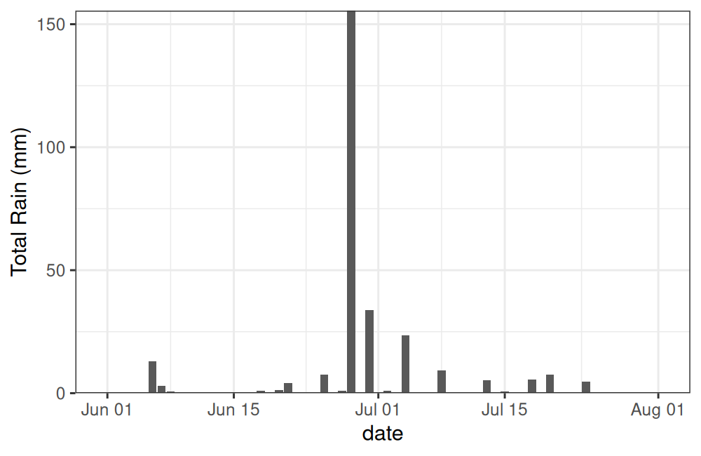

[`tidyhydat`](https://docs.ropensci.org/tidyhydat) is another R package for accessing
data from ECCC. In this case, `tidyhydat` gives access to the [National Water Data Archive
(HYDAT)](https://www.canada.ca/en/environment-climate-change/services/water-overview/quantity/monitoring/survey/data-products-services/national-archive-hydat.html).

HYDAT contains lots of data including stream flow (historical and real-time), water levels,
station metrics and information on data types and codes.

Here we'll go through a brief example of how hydrology data from `tidyhydat`
can compliment weather data from `weathercan` (and vice versa).

## Setup

### Loading packages


```r
library(weathercan)
library(tidyhydat)

library(dplyr)
library(ggplot2)
library(lubridate)
library(glue)
```

### Prep HYDAT data

`tidyhydat` data needs to be downloaded and cached locally in order to be used
(Note, this can take a while!)


```r
download_hydat()
```


## Exploring climate and hydrology

In the summer of 2020, my region (Brandon, Manitoba) experienced an incredibly
heavy rain fall event. Our downspout was ripped off the gutter and many people in the
area experienced flooding as rain poured into their basements.

Let's take a look at how this event was captured by weather and hydrometric stations
monitored by ECCC.

The event occurred in late June/early July, so let's give ourselves a two-month
range.


```r
dates <- c("2020-06-01", "2020-08-01")
```

We'll find a local Brandon weather station that has daily data for this range

```r
stations_search("brandon", interval = "day",
                starts_latest = 2020, ends_earliest = 2020)
```

```
## # A tibble: 2 × 16
##   prov  station_name station_id climate_id WMO_id TC_id   lat   lon  elev tz        interval start   end normals
##   <chr> <chr>             <dbl> <chr>       <dbl> <chr> <dbl> <dbl> <dbl> <chr>     <chr>    <dbl> <dbl> <lgl>  
## 1 MB    BRANDON A         50821 5010481     71140 YBR    49.9 -100.  409. Etc/GMT+6 day       2012  2022 FALSE  
## 2 MB    BRANDON RCS       49909 5010490     71136 PBO    49.9 -100.  409. Etc/GMT+6 day       2012  2022 FALSE  
## # … with 2 more variables: normals_1981_2010 <lgl>, normals_1971_2000 <lgl>
```

In this case "A" is for "Airport", let's go with that!


```r
rain <- weather_dl(station_ids = 50821, interval = "day", start = dates[1], end = dates[2])
```

Take a quick look:


```r
ggplot(data = rain, aes(x = date, y = total_rain)) +
  theme_bw() +
  geom_bar(stat = "identity") +
  scale_y_continuous(name = "Total Rain (mm)", expand = c(0,0))
```



Yikes! You can see why my downspout came off!

Now let's get some HYDAT data to compare. First we'll find a local station


```r
search_stn_name("brandon")
```

```
## # A tibble: 4 × 5
##   STATION_NUMBER STATION_NAME                                PROV_TERR_STATE_LOC LATITUDE LONGITUDE
##   <chr>          <chr>                                       <chr>                  <dbl>     <dbl>
## 1 05MH001        ASSINIBOINE RIVER AT BRANDON                MB                      49.9    -100. 
## 2 05MH006        LITTLE SOURIS RIVER NEAR BRANDON            MB                      49.7     -99.8
## 3 02OC007        MASKINONGE (LAC) A SAINT GABRIEL DE BRANDON QC                      46.3     -73.4
## 4 05MH013        ASSINIBOINE RIVER NEAR BRANDON              MB                      49.9    -100.
```

There are a couple of options, but whoops, one's from Quebec! Let's filter this
to only Manitoba and only stations with 2020 data with the `hy_stn_data_range()`
function.


```r
search_stn_name("brandon") %>%
  filter(PROV_TERR_STATE_LOC == "MB") %>%
  pull(STATION_NUMBER) %>%
  hy_stn_data_range() %>%
  filter(Year_from <= 2020, Year_to >= 2020)
```

```
##   Queried from version of HYDAT released on 2022-01-17
##    Observations:                      2
##    Station(s) returned:               1
##    Stations requested but not returned: 
##     All stations returned.
## # A tibble: 2 × 6
##   STATION_NUMBER DATA_TYPE SED_DATA_TYPE Year_from Year_to RECORD_LENGTH
##   <chr>          <chr>     <chr>             <int>   <int>         <int>
## 1 05MH001        H         <NA>               2014    2020             7
## 2 05MH001        Q         <NA>               1906    2020            75
```

Hmm, let's see what kind of data is available by looking at the included
`hy_data_types` data frame.


```r
filter(hy_data_types, DATA_TYPE %in% c("H", "Q"))
```

```
## # A tibble: 2 × 3
##   DATA_TYPE DATA_TYPE_EN DATA_TYPE_FR 
##   <chr>     <chr>        <chr>        
## 1 H         Water Level  Niveaux d'eau
## 2 Q         Flow         Debit
```

Great! We have both flow and water level data for a station number "05MH001",
"Assiniboine River at Brandon".


Let's grab the flow and water level data for this station.

```r
flow <- hy_daily_flows(station_number = "05MH001",
                       start_date = dates[1], end_date = dates[2])
level <- hy_daily_levels(station_number = "05MH001",
                         start_date = dates[1], end_date = dates[2])
```

### Ploting rain and flow


```r
g <- ggplot() +
  theme_bw() +
  theme(axis.title.x = element_blank()) +
  geom_bar(data = rain, aes(x = date, y = (total_rain * 2)), stat = "identity",
           alpha = 0.7, fill = "cornflowerblue") +
  geom_line(data = flow, aes(x = Date, y = Value)) +
  scale_y_continuous(name = bquote(Total~Flow~(m^3/s)), expand = c(0, 0),
                     limits = c(0, max(flow$Value * 1.1)),
                     sec.axis = sec_axis(trans = ~ . / 2, name = "Total Rain (mm)"))
g
```


Interesting, looks like there's a bit of a lag between the rain event and the
dramatic increase in water flow in the Assiniboine (unsurprisingly, this is
called "lag to peak").

Let's add a bit of information about this lag to peak.


```r
d <- data.frame(dates = c(rain$date[which.max(rain$total_precip)],
                          flow$Date[which.max(flow$Value)]),
                y = max(flow$Value) + 5)

g +
  geom_path(data = d, aes(x = dates, y = y),
              arrow = arrow(length = unit(0.25, "lines"), ends = "both", type = "closed")) +
  annotate(geom = "text",
           x = d$dates[1] + (d$dates[2] - d$dates[1])/2,
           y = d$y[1] + 10,
           label = glue("{d$dates[2] - d$dates[1]}-day delay"))
```


We can expect a lag like this because much of the flow being captured by the Brandon HYDAT
station is from precipitation in the upstream catchment area (not only from
local contributions), which takes time to travel.


### Ploting rain and water level


```r
g <- ggplot() +
  theme_bw() +
  theme(axis.title.x = element_blank()) +
  geom_bar(data = rain,
           aes(x = date, y = (total_rain/65) + min(level$Value)),
           stat = "identity", alpha = 0.7, fill = "cornflowerblue") +
  geom_line(data = level, aes(x = Date, y = Value)) +
  scale_y_continuous(name = "Water Level (m)", expand = c(0, 0),
                     sec.axis = sec_axis(trans = ~ (. - min(level$Value)) * 65,
                                         name = "Total Rain (mm)")) +
  coord_cartesian(ylim = c(min(level$Value), max(level$Value)*1.001))
g
```


Again there looks to be a lag, let's see if it's the same as before.


```r
d <- data.frame(dates = c(rain$date[which.max(rain$total_precip)],
                          level$Date[which.max(level$Value)]),
                y = max(level$Value)*1.00025)

g +
  geom_path(data = d, aes(x = dates, y = y),
              arrow = arrow(length = unit(0.25, "lines"), ends = "both", type = "closed")) +
  annotate(geom = "text",
           x = d$dates[1] + (d$dates[2] - d$dates[1])/2,
           y = d$y[1] * 1.0002,
           label = glue("{d$dates[2] - d$dates[1]}-day delay"))
```


### Ploting flow and water level

Looks like the flow and water level match up, perhaps we should take a closer look.


```r
ggplot() +
  theme_bw() +
  theme(legend.position = c(0.8, 0.8)) +
  geom_line(data = flow, aes(x = Date, y = Value, colour = "Flow"),
            size = 2) +
  geom_line(data = level, size = 1,
            aes(x = Date, y = (Value - min(Value) + 0.1) * 130, colour = "Level")) +
  scale_y_continuous(bquote(Total~Flow~(m^3/s)), expand = c(0, 0),
                     sec.axis = sec_axis(trans = ~ ./130 + min(level$Value) - 0.1,
                                         name = "Water Level (m)")) +
  scale_colour_manual(name = "Type",
                      values = c("Flow" = "cornflowerblue",
                                 "Level" = "grey30"))
```

```
## Warning: Using `size` aesthetic for lines was deprecated in ggplot2 3.4.0.
## ℹ Please use `linewidth` instead.
```


Almost a perfect match between water level and flow (which makes sense).


> Hopefully this short article gives you a sense of how you might combine different
> types of ECCC data gathered via different R packages for a more comprehensive
> look at the world around.


