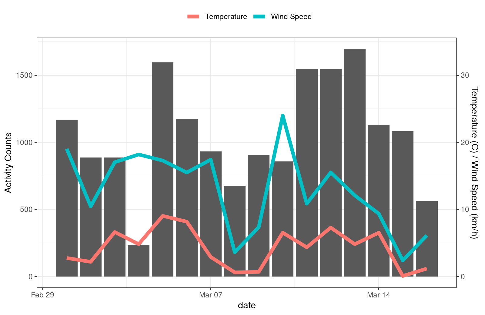

## Packages

You'll need several packages from the **tidyverse** in addition to **`weathercan`** to complete the following analysis.


```r
library(weathercan)
library(ggplot2)
library(dplyr)
```

## General usage
You can merge weather data with other data frames by linearly interpolating between points.

For example, here we have a dataset of weather data from Kamloops


```r
glimpse(kamloops)
```

```
## Rows: 4,368
## Columns: 37
## $ station_name     <chr> "KAMLOOPS A", "KAMLOOPS A", "KAMLOOPS A", "KAMLOOPS A", "KAMLOOPS A", "KAMLOOPS A", "KAMLOOPS A", …
## $ station_id       <dbl> 51423, 51423, 51423, 51423, 51423, 51423, 51423, 51423, 51423, 51423, 51423, 51423, 51423, 51423, …
## $ station_operator <lgl> NA, NA, NA, NA, NA, NA, NA, NA, NA, NA, NA, NA, NA, NA, NA, NA, NA, NA, NA, NA, NA, NA, NA, NA, NA…
## $ prov             <chr> "BC", "BC", "BC", "BC", "BC", "BC", "BC", "BC", "BC", "BC", "BC", "BC", "BC", "BC", "BC", "BC", "B…
## $ lat              <dbl> 50.7, 50.7, 50.7, 50.7, 50.7, 50.7, 50.7, 50.7, 50.7, 50.7, 50.7, 50.7, 50.7, 50.7, 50.7, 50.7, 50…
## $ lon              <dbl> -120.45, -120.45, -120.45, -120.45, -120.45, -120.45, -120.45, -120.45, -120.45, -120.45, -120.45,…
## $ elev             <dbl> 345.3, 345.3, 345.3, 345.3, 345.3, 345.3, 345.3, 345.3, 345.3, 345.3, 345.3, 345.3, 345.3, 345.3, …
## $ climate_id       <chr> "1163781", "1163781", "1163781", "1163781", "1163781", "1163781", "1163781", "1163781", "1163781",…
## $ WMO_id           <chr> "71887", "71887", "71887", "71887", "71887", "71887", "71887", "71887", "71887", "71887", "71887",…
## $ TC_id            <chr> "YKA", "YKA", "YKA", "YKA", "YKA", "YKA", "YKA", "YKA", "YKA", "YKA", "YKA", "YKA", "YKA", "YKA", …
## $ date             <date> 2016-01-01, 2016-01-01, 2016-01-01, 2016-01-01, 2016-01-01, 2016-01-01, 2016-01-01, 2016-01-01, 2…
## $ time             <dttm> 2016-01-01 00:00:00, 2016-01-01 01:00:00, 2016-01-01 02:00:00, 2016-01-01 03:00:00, 2016-01-01 04…
## $ year             <chr> "2016", "2016", "2016", "2016", "2016", "2016", "2016", "2016", "2016", "2016", "2016", "2016", "2…
## $ month            <chr> "01", "01", "01", "01", "01", "01", "01", "01", "01", "01", "01", "01", "01", "01", "01", "01", "0…
## $ day              <chr> "01", "01", "01", "01", "01", "01", "01", "01", "01", "01", "01", "01", "01", "01", "01", "01", "0…
## $ hour             <chr> "00:00", "01:00", "02:00", "03:00", "04:00", "05:00", "06:00", "07:00", "08:00", "09:00", "10:00",…
## $ weather          <chr> NA, "Mostly Cloudy", NA, NA, "Cloudy", NA, NA, "Cloudy", NA, "Snow", "Snow", "Snow", "Snow", "Snow…
## $ hmdx             <dbl> NA, NA, NA, NA, NA, NA, NA, NA, NA, NA, NA, NA, NA, NA, NA, NA, NA, NA, NA, NA, NA, NA, NA, NA, NA…
## $ hmdx_flag        <chr> NA, NA, NA, NA, NA, NA, NA, NA, NA, NA, NA, NA, NA, NA, NA, NA, NA, NA, NA, NA, NA, NA, NA, NA, NA…
## $ precip_amt       <dbl> NA, NA, NA, NA, NA, NA, NA, NA, NA, NA, NA, NA, NA, NA, NA, NA, NA, NA, NA, NA, NA, NA, NA, NA, NA…
## $ precip_amt_flag  <chr> NA, NA, NA, NA, NA, NA, NA, NA, NA, NA, NA, NA, NA, NA, NA, NA, NA, NA, NA, NA, NA, NA, NA, NA, NA…
## $ pressure         <dbl> 99.95, 99.93, 99.92, 99.90, 99.86, 99.82, 99.80, 99.78, 99.77, 99.78, 99.79, 99.74, 99.69, 99.62, …
## $ pressure_flag    <chr> NA, NA, NA, NA, NA, NA, NA, NA, NA, NA, NA, NA, NA, NA, NA, NA, NA, NA, NA, NA, NA, NA, NA, NA, NA…
## $ rel_hum          <dbl> 74, 76, 74, 73, 70, 71, 69, 69, 71, 71, 71, 70, 69, 70, 68, 68, 70, 74, 73, 74, 74, 74, 77, 72, 72…
## $ rel_hum_flag     <chr> NA, NA, NA, NA, NA, NA, NA, NA, NA, NA, NA, NA, NA, NA, NA, NA, NA, NA, NA, NA, NA, NA, NA, NA, NA…
## $ temp             <dbl> -9.1, -9.6, -9.9, -9.5, -9.4, -9.8, -10.0, -10.2, -10.1, -9.7, -9.4, -9.0, -8.6, -8.2, -8.1, -7.7,…
## $ temp_dew         <dbl> -12.9, -13.1, -13.7, -13.5, -13.9, -14.1, -14.7, -14.9, -14.4, -14.0, -13.7, -13.5, -13.3, -12.8, …
## $ temp_dew_flag    <chr> NA, NA, NA, NA, NA, NA, NA, NA, NA, NA, NA, NA, NA, NA, NA, NA, NA, NA, NA, NA, NA, NA, NA, NA, NA…
## $ temp_flag        <chr> NA, NA, NA, NA, NA, NA, NA, NA, NA, NA, NA, NA, NA, NA, NA, NA, NA, NA, NA, NA, NA, NA, NA, NA, NA…
## $ visib            <dbl> 64.4, 64.4, 64.4, 64.4, 64.4, 64.4, 64.4, 64.4, 48.3, 48.3, 48.3, 48.3, 48.3, 48.3, 48.3, 48.3, 24…
## $ visib_flag       <chr> NA, NA, NA, NA, NA, NA, NA, NA, NA, NA, NA, NA, NA, NA, NA, NA, NA, NA, NA, NA, NA, NA, NA, NA, NA…
## $ wind_chill       <dbl> -17, -17, -18, -17, -17, -17, -18, -17, -17, -16, -15, -14, -14, -13, -13, -13, -13, -14, -13, -14…
## $ wind_chill_flag  <chr> NA, NA, NA, NA, NA, NA, NA, NA, NA, NA, NA, NA, NA, NA, NA, NA, NA, NA, NA, NA, NA, NA, NA, NA, NA…
## $ wind_dir         <dbl> 13, 11, 11, 11, 11, 10, 9, 7, 7, 10, 11, 10, 10, 13, 11, 10, 10, 9, 12, 10, 13, 12, 10, 12, NA, 32…
## $ wind_dir_flag    <chr> NA, NA, NA, NA, NA, NA, NA, NA, NA, NA, NA, NA, NA, NA, NA, NA, NA, NA, NA, NA, NA, NA, NA, NA, NA…
## $ wind_spd         <dbl> 19, 20, 20, 18, 18, 16, 23, 15, 14, 15, 12, 11, 12, 9, 10, 12, 11, 12, 10, 11, 11, 6, 6, 4, 0, 4, …
## $ wind_spd_flag    <chr> NA, NA, NA, NA, NA, NA, NA, NA, NA, NA, NA, NA, NA, NA, NA, NA, NA, NA, NA, NA, NA, NA, NA, NA, NA…
```

As well as a data set of finch visits to an RFID feeder

```r
glimpse(finches)
```

```
## Rows: 16,886
## Columns: 10
## $ animal_id <fct> 041868FF93, 041868FF93, 041868FF93, 06200003BB, 06200003BB, 06200003BB, 06200003BB, 06200003BB, 041868BED…
## $ date      <date> 2016-03-01, 2016-03-01, 2016-03-01, 2016-03-01, 2016-03-01, 2016-03-01, 2016-03-01, 2016-03-01, 2016-03-…
## $ time      <dttm> 2016-03-01 06:57:42, 2016-03-01 06:58:41, 2016-03-01 07:07:21, 2016-03-01 07:32:34, 2016-03-01 07:32:35,…
## $ logger_id <fct> 2300, 2300, 2300, 2400, 2400, 2400, 2400, 2400, 2300, 2300, 2300, 2300, 2300, 2400, 2300, 2400, 2400, 240…
## $ species   <chr> "Mountain Chickadee", "Mountain Chickadee", "Mountain Chickadee", "House Finch", "House Finch", "House Fi…
## $ age       <chr> "AHY", "AHY", "AHY", "SY", "SY", "SY", "SY", "SY", "AHY", "AHY", "AHY", "AHY", "AHY", "SY", "AHY", "SY", …
## $ sex       <chr> "U", "U", "U", "M", "M", "M", "M", "M", "F", "F", "F", "F", "F", "M", "F", "M", "M", "M", "M", "M", "F", …
## $ site_name <chr> "Kamloops, BC", "Kamloops, BC", "Kamloops, BC", "Kamloops, BC", "Kamloops, BC", "Kamloops, BC", "Kamloops…
## $ lon       <dbl> -120.3622, -120.3622, -120.3622, -120.3635, -120.3635, -120.3635, -120.3635, -120.3635, -120.3622, -120.3…
## $ lat       <dbl> 50.66967, 50.66967, 50.66967, 50.66938, 50.66938, 50.66938, 50.66938, 50.66938, 50.66967, 50.66967, 50.66…
```

Although the times in the weather data do not exactly match those in the finch data, we can merge them together through linear [interpolation](https://en.wikipedia.org/wiki/Linear_interpolation). This function uses the `approx` function from the `stats` package under the hood.

Here we specify that we only want the temperature (`temp`) column:


```r
finches_temperature <- weather_interp(data = finches, weather = kamloops, cols = "temp")
```

```
## temp is missing 4 out of 4368 data, interpolation may be less accurate as a result.
```

Ooops! What happened?

Well the weather data on Kamloops returned by `weathercan` has times set in the
'local' timezone (without) daylight savings. For simplicity, these times are
scored as "UTC" according to R.


```r
kamloops$time[1:5]
```

```
## [1] "2016-01-01 00:00:00 UTC" "2016-01-01 01:00:00 UTC" "2016-01-01 02:00:00 UTC" "2016-01-01 03:00:00 UTC"
## [5] "2016-01-01 04:00:00 UTC"
```


The `finches` data, on the other hand, is set in a true timezone:

```r
finches$time[1:5]
```

```
## [1] "2016-03-01 06:57:42 UTC" "2016-03-01 06:58:41 UTC" "2016-03-01 07:07:21 UTC" "2016-03-01 07:32:34 UTC"
## [5] "2016-03-01 07:32:35 UTC"
```

This means that it also has daylight savings applied, eep!

To interpolate, the data must be in the same timezone. The easiest way forward
is to convert the `finches` data to the same, 'local' time without daylight
savings as the `kamloops` data. 

First we'll transform it to non-daylight savings
(i.e. Etc/GMT+8, note that the +8 is [intentionally inverted](https://en.wikipedia.org/wiki/List_of_tz_database_time_zones))
with the `with_tz()` function from the `lubridate` package.


```r
finches <- mutate(finches, time = lubridate::with_tz(time, "Etc/GMT+8"))
```

Now we'll force to UTC with the `force_tz()` function from the `lubridate` package.


```r
finches <- mutate(finches, time = lubridate::force_tz(time, "UTC"))
```

Now `finches` and `kamloops` data are in the same nominal and actual timezones!

Let's continue


```r
finches_temperature <- weather_interp(data = finches, weather = kamloops, cols = "temp")
```

```
## temp is missing 4 out of 4368 data, interpolation may be less accurate as a result.
```

```r
summary(finches_temperature)
```

```
##       animal_id         date                 time                        logger_id     species              age           
##  0620000513:7624   Min.   :2016-03-01   Min.   :2016-02-29 22:57:42.00   1500:6370   Length:16886       Length:16886      
##  041868D861:2767   1st Qu.:2016-03-05   1st Qu.:2016-03-05 05:54:13.25   2100: 968   Class :character   Class :character  
##  0620000514:1844   Median :2016-03-09   Median :2016-03-09 08:54:47.00   2200:2266   Mode  :character   Mode  :character  
##  06200004F8:1386   Mean   :2016-03-08   Mean   :2016-03-08 23:45:58.05   2300:3531                                        
##  041868BED6: 944   3rd Qu.:2016-03-13   3rd Qu.:2016-03-13 00:24:58.75   2400:1477                                        
##  06200003BB: 708   Max.   :2016-03-16   Max.   :2016-03-16 08:39:30.00   2700:2274                                        
##  (Other)   :1613                                                                                                          
##      sex             site_name              lon              lat             temp       
##  Length:16886       Length:16886       Min.   :-120.4   Min.   :50.67   Min.   :-2.578  
##  Class :character   Class :character   1st Qu.:-120.4   1st Qu.:50.67   1st Qu.: 2.410  
##  Mode  :character   Mode  :character   Median :-120.4   Median :50.67   Median : 4.820  
##                                        Mean   :-120.4   Mean   :50.67   Mean   : 4.731  
##                                        3rd Qu.:-120.4   3rd Qu.:50.67   3rd Qu.: 7.260  
##                                        Max.   :-120.4   Max.   :50.67   Max.   :11.989  
## 
```

```r
glimpse(finches_temperature)
```

```
## Rows: 16,886
## Columns: 11
## $ animal_id <fct> 041868FF93, 041868FF93, 041868FF93, 06200003BB, 06200003BB, 06200003BB, 06200003BB, 06200003BB, 041868BED…
## $ date      <date> 2016-03-01, 2016-03-01, 2016-03-01, 2016-03-01, 2016-03-01, 2016-03-01, 2016-03-01, 2016-03-01, 2016-03-…
## $ time      <dttm> 2016-02-29 22:57:42, 2016-02-29 22:58:41, 2016-02-29 23:07:21, 2016-02-29 23:32:34, 2016-02-29 23:32:35,…
## $ logger_id <fct> 2300, 2300, 2300, 2400, 2400, 2400, 2400, 2400, 2300, 2300, 2300, 2300, 2300, 2400, 2300, 2400, 2400, 240…
## $ species   <chr> "Mountain Chickadee", "Mountain Chickadee", "Mountain Chickadee", "House Finch", "House Finch", "House Fi…
## $ age       <chr> "AHY", "AHY", "AHY", "SY", "SY", "SY", "SY", "SY", "AHY", "AHY", "AHY", "AHY", "AHY", "SY", "AHY", "SY", …
## $ sex       <chr> "U", "U", "U", "M", "M", "M", "M", "M", "F", "F", "F", "F", "F", "M", "F", "M", "M", "M", "M", "M", "F", …
## $ site_name <chr> "Kamloops, BC", "Kamloops, BC", "Kamloops, BC", "Kamloops, BC", "Kamloops, BC", "Kamloops, BC", "Kamloops…
## $ lon       <dbl> -120.3622, -120.3622, -120.3622, -120.3635, -120.3635, -120.3635, -120.3635, -120.3635, -120.3622, -120.3…
## $ lat       <dbl> 50.66967, 50.66967, 50.66967, 50.66938, 50.66938, 50.66938, 50.66938, 50.66938, 50.66967, 50.66967, 50.66…
## $ temp      <dbl> 4.630667, 4.617556, 4.514250, 4.220056, 4.219861, 4.219667, 4.219472, 4.219278, 4.179028, 4.178250, 4.170…
```

Let's take a look at the interpolate points specifically

```r
compare1 <- select(finches_temperature, time, temp)
compare1 <- mutate(compare1, type = "interpolated")
compare2 <- select(kamloops, time, temp)
compare2 <- mutate(compare2, type = "original")
compare <- bind_rows(compare1, compare2)

ggplot(data = compare, aes(x = time, y = temp, colour = type)) +
  geom_point(alpha = 0.5) +
  scale_x_datetime(limits = range(compare1$time))
```

```
## Warning: Removed 4000 rows containing missing values (`geom_point()`).
```


What does this mean for our data?

```r
ggplot(data = finches_temperature, aes(x = temp, fill = animal_id)) +
  theme_bw() +
  theme(legend.position = "none") +
  geom_histogram(binwidth = 1) +
  labs(x = "Temperature (C)", y = "Activity Count", fill = "Finch ID")
```


## Data gaps

By default, gaps of 2 hours (or 2 days, with a daily scale) will be interpolated over (i.e. they will be filled with values interpolated from either side of the gap), but longer gaps will be skipped and filled with `NA`s. You can adjust this behaviour with `na_gap`. Note that as Environment and Climate Change Canada data is downloaded on an hourly scale, it makes no sense to apply `na_gap` values of less than 1.

In this example, note the larger number of `NA`s in `temp` and how it corresponds to the missing variables in the weather dataset:


```r
finches_temperature <- weather_interp(data = finches, weather = kamloops,
                                      cols = "temp", na_gap = 1)
```

```
## temp is missing 4 out of 4368 data, interpolation may be less accurate as a result.
```

```r
summary(finches_temperature)
```

```
##       animal_id         date                 time                        logger_id     species              age           
##  0620000513:7624   Min.   :2016-03-01   Min.   :2016-02-29 22:57:42.00   1500:6370   Length:16886       Length:16886      
##  041868D861:2767   1st Qu.:2016-03-05   1st Qu.:2016-03-05 05:54:13.25   2100: 968   Class :character   Class :character  
##  0620000514:1844   Median :2016-03-09   Median :2016-03-09 08:54:47.00   2200:2266   Mode  :character   Mode  :character  
##  06200004F8:1386   Mean   :2016-03-08   Mean   :2016-03-08 23:45:58.05   2300:3531                                        
##  041868BED6: 944   3rd Qu.:2016-03-13   3rd Qu.:2016-03-13 00:24:58.75   2400:1477                                        
##  06200003BB: 708   Max.   :2016-03-16   Max.   :2016-03-16 08:39:30.00   2700:2274                                        
##  (Other)   :1613                                                                                                          
##      sex             site_name              lon              lat             temp       
##  Length:16886       Length:16886       Min.   :-120.4   Min.   :50.67   Min.   :-2.578  
##  Class :character   Class :character   1st Qu.:-120.4   1st Qu.:50.67   1st Qu.: 2.397  
##  Mode  :character   Mode  :character   Median :-120.4   Median :50.67   Median : 4.819  
##                                        Mean   :-120.4   Mean   :50.67   Mean   : 4.729  
##                                        3rd Qu.:-120.4   3rd Qu.:50.67   3rd Qu.: 7.273  
##                                        Max.   :-120.4   Max.   :50.67   Max.   :11.989  
##                                                                         NA's   :246
```

```r
finches_temperature %>%
  select(date, time, temp) %>%
  filter(is.na(temp))
```

```
## # A tibble: 246 × 3
##    date       time                 temp
##    <date>     <dttm>              <dbl>
##  1 2016-03-11 2016-03-11 00:08:01    NA
##  2 2016-03-11 2016-03-11 00:08:03    NA
##  3 2016-03-11 2016-03-11 00:08:04    NA
##  4 2016-03-11 2016-03-11 00:08:06    NA
##  5 2016-03-11 2016-03-11 00:22:42    NA
##  6 2016-03-11 2016-03-11 00:22:43    NA
##  7 2016-03-11 2016-03-11 00:22:45    NA
##  8 2016-03-11 2016-03-11 00:22:53    NA
##  9 2016-03-11 2016-03-11 00:22:54    NA
## 10 2016-03-11 2016-03-11 00:23:56    NA
## # ℹ 236 more rows
```

```r
kamloops %>%
  select(time, temp) %>%
  filter(is.na(temp))
```

```
## # A tibble: 4 × 2
##   time                 temp
##   <dttm>              <dbl>
## 1 2016-02-11 19:00:00    NA
## 2 2016-03-08 13:00:00    NA
## 3 2016-03-11 01:00:00    NA
## 4 2016-04-09 00:00:00    NA
```

## Multiple weather columns

We could also add in more than one column at a time:


```r
finches_weather <- weather_interp(data = finches, weather = kamloops,
                                  cols = c("temp", "wind_spd"))
```

```
## temp is missing 4 out of 4368 data, interpolation may be less accurate as a result.
```

```
## wind_spd is missing 4 out of 4368 data, interpolation may be less accurate as a result.
```

```r
summary(finches_weather)
```

```
##       animal_id         date                 time                        logger_id     species              age           
##  0620000513:7624   Min.   :2016-03-01   Min.   :2016-02-29 22:57:42.00   1500:6370   Length:16886       Length:16886      
##  041868D861:2767   1st Qu.:2016-03-05   1st Qu.:2016-03-05 05:54:13.25   2100: 968   Class :character   Class :character  
##  0620000514:1844   Median :2016-03-09   Median :2016-03-09 08:54:47.00   2200:2266   Mode  :character   Mode  :character  
##  06200004F8:1386   Mean   :2016-03-08   Mean   :2016-03-08 23:45:58.05   2300:3531                                        
##  041868BED6: 944   3rd Qu.:2016-03-13   3rd Qu.:2016-03-13 00:24:58.75   2400:1477                                        
##  06200003BB: 708   Max.   :2016-03-16   Max.   :2016-03-16 08:39:30.00   2700:2274                                        
##  (Other)   :1613                                                                                                          
##      sex             site_name              lon              lat             temp           wind_spd     
##  Length:16886       Length:16886       Min.   :-120.4   Min.   :50.67   Min.   :-2.578   Min.   : 0.000  
##  Class :character   Class :character   1st Qu.:-120.4   1st Qu.:50.67   1st Qu.: 2.410   1st Qu.: 6.553  
##  Mode  :character   Mode  :character   Median :-120.4   Median :50.67   Median : 4.820   Median :14.096  
##                                        Mean   :-120.4   Mean   :50.67   Mean   : 4.731   Mean   :13.152  
##                                        3rd Qu.:-120.4   3rd Qu.:50.67   3rd Qu.: 7.260   3rd Qu.:17.913  
##                                        Max.   :-120.4   Max.   :50.67   Max.   :11.989   Max.   :41.405  
## 
```

```r
glimpse(finches_weather)
```

```
## Rows: 16,886
## Columns: 12
## $ animal_id <fct> 041868FF93, 041868FF93, 041868FF93, 06200003BB, 06200003BB, 06200003BB, 06200003BB, 06200003BB, 041868BED…
## $ date      <date> 2016-03-01, 2016-03-01, 2016-03-01, 2016-03-01, 2016-03-01, 2016-03-01, 2016-03-01, 2016-03-01, 2016-03-…
## $ time      <dttm> 2016-02-29 22:57:42, 2016-02-29 22:58:41, 2016-02-29 23:07:21, 2016-02-29 23:32:34, 2016-02-29 23:32:35,…
## $ logger_id <fct> 2300, 2300, 2300, 2400, 2400, 2400, 2400, 2400, 2300, 2300, 2300, 2300, 2300, 2400, 2300, 2400, 2400, 240…
## $ species   <chr> "Mountain Chickadee", "Mountain Chickadee", "Mountain Chickadee", "House Finch", "House Finch", "House Fi…
## $ age       <chr> "AHY", "AHY", "AHY", "SY", "SY", "SY", "SY", "SY", "AHY", "AHY", "AHY", "AHY", "AHY", "SY", "AHY", "SY", …
## $ sex       <chr> "U", "U", "U", "M", "M", "M", "M", "M", "F", "F", "F", "F", "F", "M", "F", "M", "M", "M", "M", "M", "F", …
## $ site_name <chr> "Kamloops, BC", "Kamloops, BC", "Kamloops, BC", "Kamloops, BC", "Kamloops, BC", "Kamloops, BC", "Kamloops…
## $ lon       <dbl> -120.3622, -120.3622, -120.3622, -120.3635, -120.3635, -120.3635, -120.3635, -120.3635, -120.3622, -120.3…
## $ lat       <dbl> 50.66967, 50.66967, 50.66967, 50.66938, 50.66938, 50.66938, 50.66938, 50.66938, 50.66967, 50.66967, 50.66…
## $ temp      <dbl> 4.630667, 4.617556, 4.514250, 4.220056, 4.219861, 4.219667, 4.219472, 4.219278, 4.179028, 4.178250, 4.170…
## $ wind_spd  <dbl> 18.88500, 18.93417, 19.49000, 21.17111, 21.17222, 21.17333, 21.17444, 21.17556, 21.40556, 21.41000, 21.45…
```

```r
finches_weather <- finches_weather %>%
  group_by(date) %>%
  summarize(n = length(time),
            temp = mean(temp),
            wind_spd = mean(wind_spd))

ggplot(data = finches_weather, aes(x = date, y = n)) +
  theme_bw() +
  theme(legend.position = "top") +
  geom_bar(stat = "identity") +
  geom_line(aes(y = temp * 50, colour = "Temperature"), size = 2) +
  geom_line(aes(y = wind_spd * 50, colour = "Wind Speed"), size = 2) +
  scale_colour_discrete(name = "") +
  scale_y_continuous(
    name = "Activity Counts",
    sec.axis = sec_axis(~. / 50, name = "Temperature (C) / Wind Speed (km/h)"))
```




