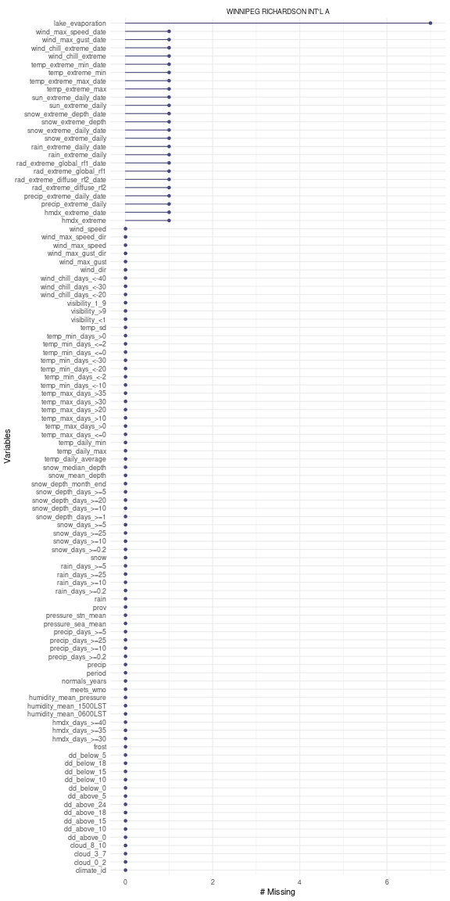

## Downloading Climate Normals

Climate Normals and Averages describe the average climate conditions specific to a particular location. These can be downloaded from Environment and Climate Change Canada using the `normals_dl()` function.

First we'll load the `weathercan` package for downloading the data and the `tidyr` package for unnesting the data (see below).


```r
library(weathercan)
library(tidyr)
library(dplyr)
library(naniar) # For exploring missing values
```

To download climate normals, we'll first find the stations we're interested in using the `stations_search()` function. We'll use the `normals_years = "current"` argument to filter to only stations with available climate normals for the `1981-2010` year range.


```r
stations_search("Winnipeg", normals_years = "current")
```

```
## # A tibble: 1 × 13
##   prov  station_name    station_id climate_id WMO_id TC_id   lat   lon  elev tz    normals
##   <chr> <chr>                <dbl> <chr>       <dbl> <chr> <dbl> <dbl> <dbl> <chr> <lgl>  
## 1 MB    WINNIPEG RICHA…       3698 5023222     71852 YWG    49.9 -97.2  239. Etc/… TRUE
```

Let's look at the climate normals from this station in Winnipeg, MB. Note that unlike the `weather_dl()` function, the `normals_dl()` function requires `climate_id` not `station_id`. By default the normals are downloaded for the years "1981-2010" (currently 1981-2010 and 1971-2000 are the only year ranges available)


```r
n <- normals_dl(climate_ids = "5023222")
n
```

```
## # A tibble: 1 × 7
##   prov  station_name                climate_id normals_years meets_wmo normals     frost  
##   <chr> <chr>                       <chr>      <chr>         <lgl>     <list>      <list> 
## 1 MB    WINNIPEG RICHARDSON INT'L A 5023222    1981-2010     TRUE      <tibble [1… <tibbl…
```

Because there are two different types of climate normals (weather measurements and first/last frost dates), the data are nested as two different datasets. We can see that the Airport (Richardson Int'l) has 197 average weather measurements/codes as well as first/last frost dates.

We can also see that this station has data quality sufficient to meet the WMO standards for temperature and precipitation (i.e. both these measurements have code >= A). See the [ECCC calculations document](https://climate.weather.gc.ca/doc/Canadian_Climate_Normals_1981_2010_Calculation_Information.pdf) for more details.

To extract either data set we can use the `unnest()` function from the `tidyr` package.


```r
normals <- unnest(n, normals)
frost <- unnest(n, frost)
```

Note that this extracts the measurements for all three stations (in the case of the `normals` data frame), but not all measurements are available for each station


```r
normals
```

```
## # A tibble: 13 × 203
##    prov  station_name          climate_id normals_years meets_wmo period temp_daily_avera…
##    <chr> <chr>                 <chr>      <chr>         <lgl>     <fct>              <dbl>
##  1 MB    WINNIPEG RICHARDSON … 5023222    1981-2010     TRUE      Jan                -16.4
##  2 MB    WINNIPEG RICHARDSON … 5023222    1981-2010     TRUE      Feb                -13.2
##  3 MB    WINNIPEG RICHARDSON … 5023222    1981-2010     TRUE      Mar                 -5.8
##  4 MB    WINNIPEG RICHARDSON … 5023222    1981-2010     TRUE      Apr                  4.4
##  5 MB    WINNIPEG RICHARDSON … 5023222    1981-2010     TRUE      May                 11.6
##  6 MB    WINNIPEG RICHARDSON … 5023222    1981-2010     TRUE      Jun                 17  
##  7 MB    WINNIPEG RICHARDSON … 5023222    1981-2010     TRUE      Jul                 19.7
##  8 MB    WINNIPEG RICHARDSON … 5023222    1981-2010     TRUE      Aug                 18.8
##  9 MB    WINNIPEG RICHARDSON … 5023222    1981-2010     TRUE      Sep                 12.7
## 10 MB    WINNIPEG RICHARDSON … 5023222    1981-2010     TRUE      Oct                  5  
## 11 MB    WINNIPEG RICHARDSON … 5023222    1981-2010     TRUE      Nov                 -4.9
## 12 MB    WINNIPEG RICHARDSON … 5023222    1981-2010     TRUE      Dec                -13.2
## 13 MB    WINNIPEG RICHARDSON … 5023222    1981-2010     TRUE      Year                 3
```

To visualize missing data we can use the `gg_miss_var()` function from the `naniar` package.

```r
select(normals, -contains("_code")) %>%  # Remove '_code' columns
  gg_miss_var(facet = station_name)
```


```r
suppressWarnings({select(normals, -contains("_code")) %>%  # Remove '_code' columns
    gg_miss_var(facet = station_name)})
```



Let's take a look at the frost data.


```r
if("normals" %in% names(frost)) frost <- select(frost, -normals) # tidyr v1
glimpse(frost)
```

```
## Rows: 7
## Columns: 13
## $ prov                                  <chr> "MB", "MB", "MB", "MB", "MB", "MB", "MB"
## $ station_name                          <chr> "WINNIPEG RICHARDSON INT'L A", "WINNIPEG R…
## $ climate_id                            <chr> "5023222", "5023222", "5023222", "5023222"…
## $ normals_years                         <chr> "1981-2010", "1981-2010", "1981-2010", "19…
## $ meets_wmo                             <lgl> TRUE, TRUE, TRUE, TRUE, TRUE, TRUE, TRUE
## $ frost_code                            <chr> "A", "A", "A", "A", "A", "A", "A"
## $ date_first_fall_frost                 <dbl> 265, 265, 265, 265, 265, 265, 265
## $ date_last_spring_frost                <dbl> 143, 143, 143, 143, 143, 143, 143
## $ length_frost_free                     <dbl> 121, 121, 121, 121, 121, 121, 121
## $ prob                                  <chr> "10%", "25%", "33%", "50%", "66%", "75%", …
## $ prob_first_fall_temp_below_0_on_date  <dbl> 255, 259, 261, 265, 268, 270, 276
## $ prob_length_frost_free                <dbl> 96, 109, 114, 119, 126, 129, 141
## $ prob_last_spring_temp_below_0_on_date <dbl> 158, 152, 148, 144, 140, 137, 129
```

### Finding stations with specific measurements

The include data frame, `normals_measurements` contains a list of stations with their corresponding measurements. Be aware that this data might be out of date!


```r
normals_measurements
```

```
## # A tibble: 307,891 × 5
##    prov  station_name climate_id normals   measurement            
##    <chr> <chr>        <chr>      <chr>     <chr>                  
##  1 AB    HORBURG      301C3D4    1981-2010 temp_daily_average     
##  2 AB    HORBURG      301C3D4    1981-2010 temp_daily_average_code
##  3 AB    HORBURG      301C3D4    1981-2010 temp_sd                
##  4 AB    HORBURG      301C3D4    1981-2010 temp_sd_code           
##  5 AB    HORBURG      301C3D4    1981-2010 temp_daily_max         
##  6 AB    HORBURG      301C3D4    1981-2010 temp_daily_max_code    
##  7 AB    HORBURG      301C3D4    1981-2010 temp_daily_min         
##  8 AB    HORBURG      301C3D4    1981-2010 temp_daily_min_code    
##  9 AB    HORBURG      301C3D4    1981-2010 temp_extreme_max       
## 10 AB    HORBURG      301C3D4    1981-2010 temp_extreme_max_code  
## # … with 307,881 more rows
```

For example, if you wanted all `climate_id`s for stations that have data on
soil temperature for 1981-2010 normals:


```r
normals_measurements %>%
  filter(stringr::str_detect(measurement, "soil"),
         normals == "1981-2010") %>%
  pull(climate_id) %>%
  unique()
```

```
##  [1] "3070560" "1100119" "112G8L1" "5021054" "5021848" "8102234" "8403600" "8501900"
##  [9] "8502800" "8202800" "8205990" "2403500" "6073960" "6104025" "6105976" "7040440"
## [17] "7042388" "4012400" "4019035" "4028060" "4043900" "4075518"
```

## Understanding Climate Normals

The measurements contained in the climate normals are very specific. To better understand how they are calculated please explore the following resources:

- ECCC Climate Normals Calculations ([1981-2010](https://climate.weather.gc.ca/doc/Canadian_Climate_Normals_1981_2010_Calculation_Information.pdf) | [1971-2000](https://climate.weather.gc.ca/doc/Canadian_Climate_Normals_1971_2000_Calculation_Information.pdf))
    - [`weathercan` Climate Normals Codes](flags.html)
- [ECCC Climate Normals Technical Documentation](https://www.canada.ca/en/environment-climate-change/services/climate-change/canadian-centre-climate-services/display-download/technical-documentation-climate-normals.html)
    - [`weathercan` Climate Normals Glossary](glossary_normals.html)


