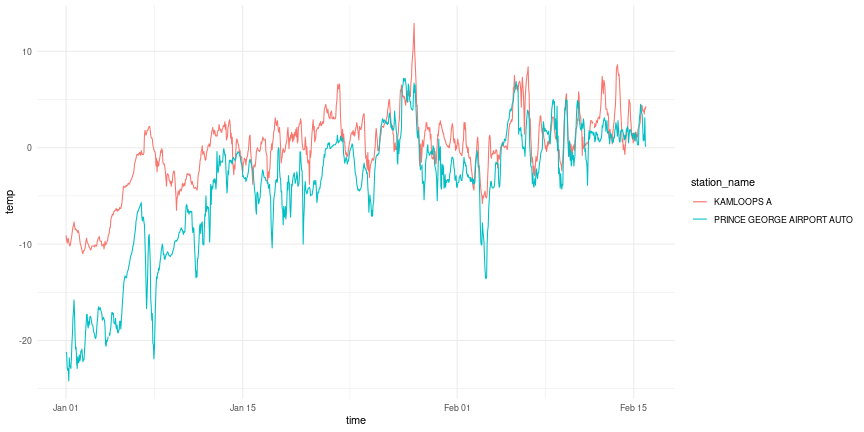

```r
library(dplyr)
library(ggplot2)
library(weathercan)
```


## Stations

`weathercan` includes the function `stations()` which returns a list of stations and their details (including `station_id`).


```r
head(stations())
```

```
## # A tibble: 6 × 16
##   prov  station_name        station_id climate_id WMO_id TC_id   lat   lon  elev tz        interval start   end normals normals_1981_2010 normals_1971_2000
##   <chr> <chr>                    <dbl> <chr>       <dbl> <chr> <dbl> <dbl> <dbl> <chr>     <chr>    <dbl> <dbl> <lgl>   <lgl>             <lgl>            
## 1 AB    DAYSLAND                  1795 301AR54        NA <NA>   52.9 -112.  689. Etc/GMT+7 day       1908  1922 FALSE   FALSE             FALSE            
## 2 AB    DAYSLAND                  1795 301AR54        NA <NA>   52.9 -112.  689. Etc/GMT+7 hour        NA    NA FALSE   FALSE             FALSE            
## 3 AB    DAYSLAND                  1795 301AR54        NA <NA>   52.9 -112.  689. Etc/GMT+7 month     1908  1922 FALSE   FALSE             FALSE            
## 4 AB    EDMONTON CORONATION       1796 301BK03        NA <NA>   53.6 -114.  671. Etc/GMT+7 day       1978  1979 FALSE   FALSE             FALSE            
## 5 AB    EDMONTON CORONATION       1796 301BK03        NA <NA>   53.6 -114.  671. Etc/GMT+7 hour        NA    NA FALSE   FALSE             FALSE            
## 6 AB    EDMONTON CORONATION       1796 301BK03        NA <NA>   53.6 -114.  671. Etc/GMT+7 month     1978  1979 FALSE   FALSE             FALSE
```

```r
glimpse(stations())
```

```
## Rows: 26,337
## Columns: 16
## $ prov              <chr> "AB", "AB", "AB", "AB", "AB", "AB", "AB", "AB", "AB", "AB", "AB", "AB", "AB", "AB", "AB", "AB", "AB", "AB", "AB", "AB", "AB", "AB", …
## $ station_name      <chr> "DAYSLAND", "DAYSLAND", "DAYSLAND", "EDMONTON CORONATION", "EDMONTON CORONATION", "EDMONTON CORONATION", "FLEET", "FLEET", "FLEET", …
## $ station_id        <dbl> 1795, 1795, 1795, 1796, 1796, 1796, 1797, 1797, 1797, 1798, 1798, 1798, 1799, 1799, 1799, 1800, 1800, 1800, 1801, 1801, 1801, 1802, …
## $ climate_id        <chr> "301AR54", "301AR54", "301AR54", "301BK03", "301BK03", "301BK03", "301B6L0", "301B6L0", "301B6L0", "301B8LR", "301B8LR", "301B8LR", …
## $ WMO_id            <dbl> NA, NA, NA, NA, NA, NA, NA, NA, NA, NA, NA, NA, NA, NA, NA, NA, NA, NA, NA, NA, NA, NA, NA, NA, NA, NA, NA, NA, NA, NA, NA, NA, NA, …
## $ TC_id             <chr> NA, NA, NA, NA, NA, NA, NA, NA, NA, NA, NA, NA, NA, NA, NA, NA, NA, NA, NA, NA, NA, NA, NA, NA, NA, NA, NA, NA, NA, NA, NA, NA, NA, …
## $ lat               <dbl> 52.87, 52.87, 52.87, 53.57, 53.57, 53.57, 52.15, 52.15, 52.15, 53.20, 53.20, 53.20, 52.40, 52.40, 52.40, 54.08, 54.08, 54.08, 53.52,…
## $ lon               <dbl> -112.28, -112.28, -112.28, -113.57, -113.57, -113.57, -111.73, -111.73, -111.73, -110.15, -110.15, -110.15, -115.20, -115.20, -115.2…
## $ elev              <dbl> 688.8, 688.8, 688.8, 670.6, 670.6, 670.6, 838.2, 838.2, 838.2, 640.0, 640.0, 640.0, 1036.0, 1036.0, 1036.0, 585.2, 585.2, 585.2, 668…
## $ tz                <chr> "Etc/GMT+7", "Etc/GMT+7", "Etc/GMT+7", "Etc/GMT+7", "Etc/GMT+7", "Etc/GMT+7", "Etc/GMT+7", "Etc/GMT+7", "Etc/GMT+7", "Etc/GMT+7", "E…
## $ interval          <chr> "day", "hour", "month", "day", "hour", "month", "day", "hour", "month", "day", "hour", "month", "day", "hour", "month", "day", "hour…
## $ start             <dbl> 1908, NA, 1908, 1978, NA, 1978, 1987, NA, 1987, 1987, NA, 1987, 1980, NA, 1980, 1980, NA, 1980, 1986, NA, 1986, 1987, NA, 1987, 1986…
## $ end               <dbl> 1922, NA, 1922, 1979, NA, 1979, 1990, NA, 1990, 1998, NA, 1998, 2009, NA, 2007, 1981, NA, 1981, 2019, NA, 2007, 1991, NA, 1991, 1995…
## $ normals           <lgl> FALSE, FALSE, FALSE, FALSE, FALSE, FALSE, FALSE, FALSE, FALSE, FALSE, FALSE, FALSE, TRUE, TRUE, TRUE, FALSE, FALSE, FALSE, TRUE, TRU…
## $ normals_1981_2010 <lgl> FALSE, FALSE, FALSE, FALSE, FALSE, FALSE, FALSE, FALSE, FALSE, FALSE, FALSE, FALSE, TRUE, TRUE, TRUE, FALSE, FALSE, FALSE, TRUE, TRU…
## $ normals_1971_2000 <lgl> FALSE, FALSE, FALSE, FALSE, FALSE, FALSE, FALSE, FALSE, FALSE, FALSE, FALSE, FALSE, FALSE, FALSE, FALSE, FALSE, FALSE, FALSE, FALSE,…
```

You can look through this data frame directly, or you can use the `stations_search` function:


```r
stations_search("Kamloops")
```

```
## # A tibble: 40 × 16
##    prov  station_name         station_id climate_id WMO_id TC_id   lat   lon  elev tz        interval start   end normals normals_1981_2010 normals_1971_2000
##    <chr> <chr>                     <dbl> <chr>       <dbl> <chr> <dbl> <dbl> <dbl> <chr>     <chr>    <dbl> <dbl> <lgl>   <lgl>             <lgl>            
##  1 BC    KAMLOOPS                   1274 1163779        NA <NA>   50.7 -120.  379. Etc/GMT+8 day       1878  1982 FALSE   FALSE             FALSE            
##  2 BC    KAMLOOPS                   1274 1163779        NA <NA>   50.7 -120.  379. Etc/GMT+8 month     1878  1982 FALSE   FALSE             FALSE            
##  3 BC    KAMLOOPS A                 1275 1163780     71887 YKA    50.7 -120.  345. Etc/GMT+8 day       1951  2013 TRUE    TRUE              TRUE             
##  4 BC    KAMLOOPS A                 1275 1163780     71887 YKA    50.7 -120.  345. Etc/GMT+8 hour      1953  2013 TRUE    TRUE              TRUE             
##  5 BC    KAMLOOPS A                 1275 1163780     71887 YKA    50.7 -120.  345. Etc/GMT+8 month     1951  2013 TRUE    TRUE              TRUE             
##  6 BC    KAMLOOPS A                51423 1163781     71887 YKA    50.7 -120.  345. Etc/GMT+8 day       2013  2021 FALSE   FALSE             FALSE            
##  7 BC    KAMLOOPS A                51423 1163781     71887 YKA    50.7 -120.  345. Etc/GMT+8 hour      2013  2021 FALSE   FALSE             FALSE            
##  8 BC    KAMLOOPS AFTON MINES       1276 1163790        NA <NA>   50.7 -120.  701  Etc/GMT+8 day       1977  1993 FALSE   FALSE             TRUE             
##  9 BC    KAMLOOPS AFTON MINES       1276 1163790        NA <NA>   50.7 -120.  701  Etc/GMT+8 month     1977  1993 FALSE   FALSE             TRUE             
## 10 BC    KAMLOOPS AUT              42203 1163842     71741 ZKA    50.7 -120.  345  Etc/GMT+8 day       2006  2021 FALSE   FALSE             FALSE            
## # … with 30 more rows
```

You can narrow down your search by specifying time intervals (options are "hour", "day", or "month"):


```r
stations_search("Kamloops", interval = "hour")
```

```
## # A tibble: 3 × 16
##   prov  station_name station_id climate_id WMO_id TC_id   lat   lon  elev tz        interval start   end normals normals_1981_2010 normals_1971_2000
##   <chr> <chr>             <dbl> <chr>       <dbl> <chr> <dbl> <dbl> <dbl> <chr>     <chr>    <dbl> <dbl> <lgl>   <lgl>             <lgl>            
## 1 BC    KAMLOOPS A         1275 1163780     71887 YKA    50.7 -120.  345. Etc/GMT+8 hour      1953  2013 TRUE    TRUE              TRUE             
## 2 BC    KAMLOOPS A        51423 1163781     71887 YKA    50.7 -120.  345. Etc/GMT+8 hour      2013  2021 FALSE   FALSE             FALSE            
## 3 BC    KAMLOOPS AUT      42203 1163842     71741 ZKA    50.7 -120.  345  Etc/GMT+8 hour      2006  2021 FALSE   FALSE             FALSE
```

You can specify more than one interval:


```r
stations_search("Kamloops", interval = c("hour", "month"))
```

```
## # A tibble: 21 × 16
##    prov  station_name            station_id climate_id WMO_id TC_id   lat   lon  elev tz        interval start   end normals normals_1981_2010 normals_1971_2000
##    <chr> <chr>                        <dbl> <chr>       <dbl> <chr> <dbl> <dbl> <dbl> <chr>     <chr>    <dbl> <dbl> <lgl>   <lgl>             <lgl>            
##  1 BC    KAMLOOPS                      1274 1163779        NA <NA>   50.7 -120.  379. Etc/GMT+8 month     1878  1982 FALSE   FALSE             FALSE            
##  2 BC    KAMLOOPS A                    1275 1163780     71887 YKA    50.7 -120.  345. Etc/GMT+8 hour      1953  2013 TRUE    TRUE              TRUE             
##  3 BC    KAMLOOPS A                    1275 1163780     71887 YKA    50.7 -120.  345. Etc/GMT+8 month     1951  2013 TRUE    TRUE              TRUE             
##  4 BC    KAMLOOPS A                   51423 1163781     71887 YKA    50.7 -120.  345. Etc/GMT+8 hour      2013  2021 FALSE   FALSE             FALSE            
##  5 BC    KAMLOOPS AFTON MINES          1276 1163790        NA <NA>   50.7 -120.  701  Etc/GMT+8 month     1977  1993 FALSE   FALSE             TRUE             
##  6 BC    KAMLOOPS AUT                 42203 1163842     71741 ZKA    50.7 -120.  345  Etc/GMT+8 hour      2006  2021 FALSE   FALSE             FALSE            
##  7 BC    KAMLOOPS AUT                 42203 1163842     71741 ZKA    50.7 -120.  345  Etc/GMT+8 month     2006  2006 FALSE   FALSE             FALSE            
##  8 BC    KAMLOOPS CDA                  1277 1163810        NA <NA>   50.7 -120.  345  Etc/GMT+8 month     1949  1977 FALSE   FALSE             FALSE            
##  9 BC    KAMLOOPS CHERRY CREEK         1278 1163814        NA <NA>   50.7 -121.  556. Etc/GMT+8 month     1970  1974 FALSE   FALSE             FALSE            
## 10 BC    KAMLOOPS CHERRY CREEK 2       1279 1163815        NA <NA>   50.6 -121.  701  Etc/GMT+8 month     1974  1977 FALSE   FALSE             FALSE            
## # … with 11 more rows
```


You can also search by proximity. These results include a new column `distance` specifying the distance in km from the coordinates:


```r
stations_search(coords = c(50.667492, -120.329049), dist = 20, interval = "hour")
```

```
## # A tibble: 3 × 17
##   prov  station_name station_id climate_id WMO_id TC_id   lat   lon  elev tz        interval start   end normals normals_1981_2010 normals_1971_2000 distance
##   <chr> <chr>             <dbl> <chr>       <dbl> <chr> <dbl> <dbl> <dbl> <chr>     <chr>    <dbl> <dbl> <lgl>   <lgl>             <lgl>                <dbl>
## 1 BC    KAMLOOPS A         1275 1163780     71887 YKA    50.7 -120.  345. Etc/GMT+8 hour      1953  2013 TRUE    TRUE              TRUE                  8.64
## 2 BC    KAMLOOPS AUT      42203 1163842     71741 ZKA    50.7 -120.  345  Etc/GMT+8 hour      2006  2021 FALSE   FALSE             FALSE                 8.64
## 3 BC    KAMLOOPS A        51423 1163781     71887 YKA    50.7 -120.  345. Etc/GMT+8 hour      2013  2021 FALSE   FALSE             FALSE                 9.28
```

We can also perform more complex searches using `filter()` function from the `dplyr` package
direction on the data returned by stations():


```r
BCstations <- stations() %>%
  filter(prov %in% c("BC")) %>%
  filter(interval == "hour") %>%
  filter(lat > 49 & lat < 49.5) %>%
  filter(lon > -119 & lon < -116) %>%
  filter(start <= 2002) %>%
  filter(end >= 2016)
BCstations
```

```
## # A tibble: 3 × 16
##   prov  station_name                station_id climate_id WMO_id TC_id   lat   lon  elev tz      interval start   end normals normals_1981_2010 normals_1971_20…
##   <chr> <chr>                            <dbl> <chr>       <dbl> <chr> <dbl> <dbl> <dbl> <chr>   <chr>    <dbl> <dbl> <lgl>   <lgl>             <lgl>           
## 1 BC    CRESTON CAMPBELL SCIENTIFIC       6838 114B1F0     71770 WJR    49.1 -116.  641. Etc/GM… hour      1994  2021 FALSE   FALSE             FALSE           
## 2 BC    NELSON CS                         6839 1145M29     71776 WNM    49.5 -117.  535. Etc/GM… hour      1994  2021 FALSE   FALSE             FALSE           
## 3 BC    WARFIELD RCS                     31067 1148705     71401 XWF    49.1 -118.  567. Etc/GM… hour      2001  2021 FALSE   FALSE             FALSE
```

```r
## weather_dl() accepts numbers so we can create a vector to input into weather:
stn_vector <- BCstations$station_id
stn_vector
```

```
## [1]  6838  6839 31067
```

You can update this list of stations with


```r
stations_dl()
```

And check when it was last updated with

```r
stations_meta()
```

```
## $ECCC_modified
## [1] "2021-10-31 23:34:00 UTC"
## 
## $weathercan_modified
## [1] "2021-11-30"
```


## Weather

Once you have your `station_id`(s) you can download weather data:


```r
kam <- weather_dl(station_ids = 51423, start = "2016-01-01", end = "2016-02-15")
```

```
## As of weathercan v0.3.0 time display is either local time or UTC
## See Details under ?weather_dl for more information.
## This message is shown once per session
```

```r
kam
```

```
## # A tibble: 1,104 × 37
##    station_name station_id station_operator prov    lat   lon  elev climate_id WMO_id TC_id date       time                year  month day   hour  weather  hmdx
##    <chr>             <dbl> <lgl>            <chr> <dbl> <dbl> <dbl> <chr>      <chr>  <chr> <date>     <dttm>              <chr> <chr> <chr> <chr> <chr>   <dbl>
##  1 KAMLOOPS A        51423 NA               BC     50.7 -120.  345. 1163781    71887  YKA   2016-01-01 2016-01-01 00:00:00 2016  01    01    00:00 <NA>       NA
##  2 KAMLOOPS A        51423 NA               BC     50.7 -120.  345. 1163781    71887  YKA   2016-01-01 2016-01-01 01:00:00 2016  01    01    01:00 Mostly…    NA
##  3 KAMLOOPS A        51423 NA               BC     50.7 -120.  345. 1163781    71887  YKA   2016-01-01 2016-01-01 02:00:00 2016  01    01    02:00 <NA>       NA
##  4 KAMLOOPS A        51423 NA               BC     50.7 -120.  345. 1163781    71887  YKA   2016-01-01 2016-01-01 03:00:00 2016  01    01    03:00 <NA>       NA
##  5 KAMLOOPS A        51423 NA               BC     50.7 -120.  345. 1163781    71887  YKA   2016-01-01 2016-01-01 04:00:00 2016  01    01    04:00 Cloudy     NA
##  6 KAMLOOPS A        51423 NA               BC     50.7 -120.  345. 1163781    71887  YKA   2016-01-01 2016-01-01 05:00:00 2016  01    01    05:00 <NA>       NA
##  7 KAMLOOPS A        51423 NA               BC     50.7 -120.  345. 1163781    71887  YKA   2016-01-01 2016-01-01 06:00:00 2016  01    01    06:00 <NA>       NA
##  8 KAMLOOPS A        51423 NA               BC     50.7 -120.  345. 1163781    71887  YKA   2016-01-01 2016-01-01 07:00:00 2016  01    01    07:00 Cloudy     NA
##  9 KAMLOOPS A        51423 NA               BC     50.7 -120.  345. 1163781    71887  YKA   2016-01-01 2016-01-01 08:00:00 2016  01    01    08:00 <NA>       NA
## 10 KAMLOOPS A        51423 NA               BC     50.7 -120.  345. 1163781    71887  YKA   2016-01-01 2016-01-01 09:00:00 2016  01    01    09:00 Snow       NA
## # … with 1,094 more rows, and 19 more variables: hmdx_flag <chr>, precip_amt <dbl>, precip_amt_flag <chr>, pressure <dbl>, pressure_flag <chr>, rel_hum <dbl>,
## #   rel_hum_flag <chr>, temp <dbl>, temp_dew <dbl>, temp_dew_flag <chr>, temp_flag <chr>, visib <dbl>, visib_flag <chr>, wind_chill <dbl>,
## #   wind_chill_flag <chr>, wind_dir <dbl>, wind_dir_flag <chr>, wind_spd <dbl>, wind_spd_flag <chr>
```

You can also download data from multiple stations at once:


```r
kam.pg <- weather_dl(station_ids = c(48248, 51423), start = "2016-01-01", end = "2016-02-15")

kam.pg
```

```
## # A tibble: 2,208 × 37
##    station_name station_id station_operator prov    lat   lon  elev climate_id WMO_id TC_id date       time                year  month day   hour  weather  hmdx
##    <chr>             <dbl> <lgl>            <chr> <dbl> <dbl> <dbl> <chr>      <chr>  <chr> <date>     <dttm>              <chr> <chr> <chr> <chr> <chr>   <dbl>
##  1 PRINCE GEOR…      48248 NA               BC     53.9 -123.   680 1096453    71302  VXS   2016-01-01 2016-01-01 00:00:00 2016  01    01    00:00 <NA>       NA
##  2 PRINCE GEOR…      48248 NA               BC     53.9 -123.   680 1096453    71302  VXS   2016-01-01 2016-01-01 01:00:00 2016  01    01    01:00 <NA>       NA
##  3 PRINCE GEOR…      48248 NA               BC     53.9 -123.   680 1096453    71302  VXS   2016-01-01 2016-01-01 02:00:00 2016  01    01    02:00 <NA>       NA
##  4 PRINCE GEOR…      48248 NA               BC     53.9 -123.   680 1096453    71302  VXS   2016-01-01 2016-01-01 03:00:00 2016  01    01    03:00 <NA>       NA
##  5 PRINCE GEOR…      48248 NA               BC     53.9 -123.   680 1096453    71302  VXS   2016-01-01 2016-01-01 04:00:00 2016  01    01    04:00 <NA>       NA
##  6 PRINCE GEOR…      48248 NA               BC     53.9 -123.   680 1096453    71302  VXS   2016-01-01 2016-01-01 05:00:00 2016  01    01    05:00 <NA>       NA
##  7 PRINCE GEOR…      48248 NA               BC     53.9 -123.   680 1096453    71302  VXS   2016-01-01 2016-01-01 06:00:00 2016  01    01    06:00 <NA>       NA
##  8 PRINCE GEOR…      48248 NA               BC     53.9 -123.   680 1096453    71302  VXS   2016-01-01 2016-01-01 07:00:00 2016  01    01    07:00 <NA>       NA
##  9 PRINCE GEOR…      48248 NA               BC     53.9 -123.   680 1096453    71302  VXS   2016-01-01 2016-01-01 08:00:00 2016  01    01    08:00 <NA>       NA
## 10 PRINCE GEOR…      48248 NA               BC     53.9 -123.   680 1096453    71302  VXS   2016-01-01 2016-01-01 09:00:00 2016  01    01    09:00 <NA>       NA
## # … with 2,198 more rows, and 19 more variables: hmdx_flag <chr>, precip_amt <dbl>, precip_amt_flag <chr>, pressure <dbl>, pressure_flag <chr>, rel_hum <dbl>,
## #   rel_hum_flag <chr>, temp <dbl>, temp_dew <dbl>, temp_dew_flag <chr>, temp_flag <chr>, visib <dbl>, visib_flag <chr>, wind_chill <dbl>,
## #   wind_chill_flag <chr>, wind_dir <dbl>, wind_dir_flag <chr>, wind_spd <dbl>, wind_spd_flag <chr>
```


And plot it:


```r
ggplot(data = kam.pg, aes(x = time, y = temp, group = station_name, colour = station_name)) +
  theme(legend.position = "top") +
  geom_line() +
  theme_minimal()
```



Or you can use the vector created above:


```r
stn_vec_df <- weather_dl(station_ids = stn_vector, start = "2016-01-01", end = "2016-02-15")

stn_vec_df
```

```
## # A tibble: 3,312 × 37
##    station_name station_id station_operator prov    lat   lon  elev climate_id WMO_id TC_id date       time                year  month day   hour  weather  hmdx
##    <chr>             <dbl> <lgl>            <chr> <dbl> <dbl> <dbl> <chr>      <chr>  <chr> <date>     <dttm>              <chr> <chr> <chr> <chr> <chr>   <dbl>
##  1 CRESTON CAM…       6838 NA               BC     49.1 -116.  641. 114B1F0    71770  WJR   2016-01-01 2016-01-01 00:00:00 2016  01    01    00:00 <NA>       NA
##  2 CRESTON CAM…       6838 NA               BC     49.1 -116.  641. 114B1F0    71770  WJR   2016-01-01 2016-01-01 01:00:00 2016  01    01    01:00 <NA>       NA
##  3 CRESTON CAM…       6838 NA               BC     49.1 -116.  641. 114B1F0    71770  WJR   2016-01-01 2016-01-01 02:00:00 2016  01    01    02:00 <NA>       NA
##  4 CRESTON CAM…       6838 NA               BC     49.1 -116.  641. 114B1F0    71770  WJR   2016-01-01 2016-01-01 03:00:00 2016  01    01    03:00 <NA>       NA
##  5 CRESTON CAM…       6838 NA               BC     49.1 -116.  641. 114B1F0    71770  WJR   2016-01-01 2016-01-01 04:00:00 2016  01    01    04:00 <NA>       NA
##  6 CRESTON CAM…       6838 NA               BC     49.1 -116.  641. 114B1F0    71770  WJR   2016-01-01 2016-01-01 05:00:00 2016  01    01    05:00 <NA>       NA
##  7 CRESTON CAM…       6838 NA               BC     49.1 -116.  641. 114B1F0    71770  WJR   2016-01-01 2016-01-01 06:00:00 2016  01    01    06:00 <NA>       NA
##  8 CRESTON CAM…       6838 NA               BC     49.1 -116.  641. 114B1F0    71770  WJR   2016-01-01 2016-01-01 07:00:00 2016  01    01    07:00 <NA>       NA
##  9 CRESTON CAM…       6838 NA               BC     49.1 -116.  641. 114B1F0    71770  WJR   2016-01-01 2016-01-01 08:00:00 2016  01    01    08:00 <NA>       NA
## 10 CRESTON CAM…       6838 NA               BC     49.1 -116.  641. 114B1F0    71770  WJR   2016-01-01 2016-01-01 09:00:00 2016  01    01    09:00 <NA>       NA
## # … with 3,302 more rows, and 19 more variables: hmdx_flag <chr>, precip_amt <dbl>, precip_amt_flag <chr>, pressure <dbl>, pressure_flag <chr>, rel_hum <dbl>,
## #   rel_hum_flag <chr>, temp <dbl>, temp_dew <dbl>, temp_dew_flag <chr>, temp_flag <chr>, visib <dbl>, visib_flag <chr>, wind_chill <dbl>,
## #   wind_chill_flag <chr>, wind_dir <dbl>, wind_dir_flag <chr>, wind_spd <dbl>, wind_spd_flag <chr>
```

For more information on the data flags, see the [Flags vignette](flags.html), for more information on units and terms, see the [Terms and Units vignette](glossary.html).

## Climate Normals

To access climate normals, you first need to know the `climate_id` associated with the station you're interested in.


```r
stations_search("Winnipeg", normals_years = "current")
```

```
## # A tibble: 1 × 13
##   prov  station_name                station_id climate_id WMO_id TC_id   lat   lon  elev tz        normals normals_1981_2010 normals_1971_2000
##   <chr> <chr>                            <dbl> <chr>       <dbl> <chr> <dbl> <dbl> <dbl> <chr>     <lgl>   <lgl>             <lgl>            
## 1 MB    WINNIPEG RICHARDSON INT'L A       3698 5023222     71852 YWG    49.9 -97.2  239. Etc/GMT+6 TRUE    TRUE              TRUE
```

The current year range is 1981-2010, but you can also search for stations in the
previous year range:


```r
stations_search("Winnipeg", normals_years = "1971-2000")
```

```
## # A tibble: 1 × 13
##   prov  station_name                station_id climate_id WMO_id TC_id   lat   lon  elev tz        normals normals_1981_2010 normals_1971_2000
##   <chr> <chr>                            <dbl> <chr>       <dbl> <chr> <dbl> <dbl> <dbl> <chr>     <lgl>   <lgl>             <lgl>            
## 1 MB    WINNIPEG RICHARDSON INT'L A       3698 5023222     71852 YWG    49.9 -97.2  239. Etc/GMT+6 TRUE    TRUE              TRUE
```

Note that the Winnipeg station has normals for both year ranges.

Then you can download the climate normals with the `normals_dl()` function.


```r
n <- normals_dl("5023222")
```

There are two parts to the normals data, average weather measurements and average frost dates.


```r
library(tidyr)
unnest(n, normals)
```

```
## # A tibble: 13 × 203
##    prov  station_name       climate_id normals_years meets_wmo period temp_daily_avera… temp_daily_averag… temp_sd temp_sd_code temp_daily_max temp_daily_max_c…
##    <chr> <chr>              <chr>      <chr>         <lgl>     <fct>              <dbl> <chr>                <dbl> <chr>                 <dbl> <chr>            
##  1 MB    WINNIPEG RICHARDS… 5023222    1981-2010     TRUE      Jan                -16.4 A                      4.1 A                     -11.3 A                
##  2 MB    WINNIPEG RICHARDS… 5023222    1981-2010     TRUE      Feb                -13.2 A                      4.2 A                      -8.1 A                
##  3 MB    WINNIPEG RICHARDS… 5023222    1981-2010     TRUE      Mar                 -5.8 A                      3.1 A                      -0.8 A                
##  4 MB    WINNIPEG RICHARDS… 5023222    1981-2010     TRUE      Apr                  4.4 A                      2.7 A                      10.9 A                
##  5 MB    WINNIPEG RICHARDS… 5023222    1981-2010     TRUE      May                 11.6 A                      2.1 A                      18.6 A                
##  6 MB    WINNIPEG RICHARDS… 5023222    1981-2010     TRUE      Jun                 17   A                      2   A                      23.2 A                
##  7 MB    WINNIPEG RICHARDS… 5023222    1981-2010     TRUE      Jul                 19.7 A                      1.4 A                      25.9 A                
##  8 MB    WINNIPEG RICHARDS… 5023222    1981-2010     TRUE      Aug                 18.8 A                      1.9 A                      25.4 A                
##  9 MB    WINNIPEG RICHARDS… 5023222    1981-2010     TRUE      Sep                 12.7 A                      1.3 A                      19   A                
## 10 MB    WINNIPEG RICHARDS… 5023222    1981-2010     TRUE      Oct                  5   A                      1.8 A                      10.5 A                
## 11 MB    WINNIPEG RICHARDS… 5023222    1981-2010     TRUE      Nov                 -4.9 A                      3.6 A                      -0.5 A                
## 12 MB    WINNIPEG RICHARDS… 5023222    1981-2010     TRUE      Dec                -13.2 A                      4.4 A                      -8.5 A                
## 13 MB    WINNIPEG RICHARDS… 5023222    1981-2010     TRUE      Year                 3   A                      1.2 A                       8.7 A                
## # … with 191 more variables: temp_daily_min <dbl>, temp_daily_min_code <chr>, temp_extreme_max <dbl>, temp_extreme_max_code <chr>,
## #   temp_extreme_max_date <date>, temp_extreme_max_date_code <chr>, temp_extreme_min <dbl>, temp_extreme_min_code <chr>, temp_extreme_min_date <date>,
## #   temp_extreme_min_date_code <chr>, rain <dbl>, rain_code <chr>, snow <dbl>, snow_code <chr>, precip <dbl>, precip_code <chr>, snow_mean_depth <dbl>,
## #   snow_mean_depth_code <chr>, snow_median_depth <dbl>, snow_median_depth_code <chr>, snow_depth_month_end <dbl>, snow_depth_month_end_code <chr>,
## #   rain_extreme_daily <dbl>, rain_extreme_daily_code <chr>, rain_extreme_daily_date <date>, rain_extreme_daily_date_code <chr>, snow_extreme_daily <dbl>,
## #   snow_extreme_daily_code <chr>, snow_extreme_daily_date <date>, snow_extreme_daily_date_code <chr>, precip_extreme_daily <dbl>,
## #   precip_extreme_daily_code <chr>, precip_extreme_daily_date <date>, precip_extreme_daily_date_code <chr>, snow_extreme_depth <dbl>, …
```

```r
unnest(n, frost)
```

```
## # A tibble: 7 × 14
##   prov  station_name     climate_id normals_years meets_wmo normals   frost_code date_first_fall_… date_last_spring… length_frost_fr… prob  prob_first_fall_tem…
##   <chr> <chr>            <chr>      <chr>         <lgl>     <list>    <chr>                  <dbl>             <dbl>            <dbl> <chr>                <dbl>
## 1 MB    WINNIPEG RICHAR… 5023222    1981-2010     TRUE      <tibble … A                        265               143              121 10%                    255
## 2 MB    WINNIPEG RICHAR… 5023222    1981-2010     TRUE      <tibble … A                        265               143              121 25%                    259
## 3 MB    WINNIPEG RICHAR… 5023222    1981-2010     TRUE      <tibble … A                        265               143              121 33%                    261
## 4 MB    WINNIPEG RICHAR… 5023222    1981-2010     TRUE      <tibble … A                        265               143              121 50%                    265
## 5 MB    WINNIPEG RICHAR… 5023222    1981-2010     TRUE      <tibble … A                        265               143              121 66%                    268
## 6 MB    WINNIPEG RICHAR… 5023222    1981-2010     TRUE      <tibble … A                        265               143              121 75%                    270
## 7 MB    WINNIPEG RICHAR… 5023222    1981-2010     TRUE      <tibble … A                        265               143              121 90%                    276
## # … with 2 more variables: prob_length_frost_free <dbl>, prob_last_spring_temp_below_0_on_date <dbl>
```


Alternatively, download the 1971-2000 normals:


```r
n <- normals_dl("5023222", normals_years = "1971-2000")
unnest(n, normals)
```

```
## # A tibble: 13 × 229
##    prov  station_name       climate_id normals_years meets_wmo period temp_daily_avera… temp_daily_averag… temp_sd temp_sd_code temp_daily_max temp_daily_max_c…
##    <chr> <chr>              <chr>      <chr>         <lgl>     <fct>              <dbl> <chr>                <dbl> <chr>                 <dbl> <chr>            
##  1 MB    WINNIPEG RICHARDS… 5023222    1971-2000     TRUE      Jan                -17.8 A                      3.9 A                     -12.7 A                
##  2 MB    WINNIPEG RICHARDS… 5023222    1971-2000     TRUE      Feb                -13.6 A                      4.2 A                      -8.5 A                
##  3 MB    WINNIPEG RICHARDS… 5023222    1971-2000     TRUE      Mar                 -6.1 A                      3.5 A                      -1.1 A                
##  4 MB    WINNIPEG RICHARDS… 5023222    1971-2000     TRUE      Apr                  4   A                      2.7 A                      10.3 A                
##  5 MB    WINNIPEG RICHARDS… 5023222    1971-2000     TRUE      May                 12   A                      2.5 A                      19.2 A                
##  6 MB    WINNIPEG RICHARDS… 5023222    1971-2000     TRUE      Jun                 17   A                      1.8 A                      23.3 A                
##  7 MB    WINNIPEG RICHARDS… 5023222    1971-2000     TRUE      Jul                 19.5 A                      1.5 A                      25.8 A                
##  8 MB    WINNIPEG RICHARDS… 5023222    1971-2000     TRUE      Aug                 18.5 A                      1.8 A                      25   A                
##  9 MB    WINNIPEG RICHARDS… 5023222    1971-2000     TRUE      Sep                 12.3 A                      1.4 A                      18.6 A                
## 10 MB    WINNIPEG RICHARDS… 5023222    1971-2000     TRUE      Oct                  5.3 A                      1.6 A                      10.8 A                
## 11 MB    WINNIPEG RICHARDS… 5023222    1971-2000     TRUE      Nov                 -5.3 A                      3.3 A                      -0.9 A                
## 12 MB    WINNIPEG RICHARDS… 5023222    1971-2000     TRUE      Dec                -14.4 A                      4.2 A                      -9.7 A                
## 13 MB    WINNIPEG RICHARDS… 5023222    1971-2000     TRUE      Year                 2.6 A                      1.3 A                       8.3 A                
## # … with 217 more variables: temp_daily_min <dbl>, temp_daily_min_code <chr>, temp_extreme_max <dbl>, temp_extreme_max_code <chr>,
## #   temp_extreme_max_date <date>, temp_extreme_max_date_code <chr>, temp_extreme_min <dbl>, temp_extreme_min_code <chr>, temp_extreme_min_date <date>,
## #   temp_extreme_min_date_code <chr>, rain <dbl>, rain_code <chr>, snow <dbl>, snow_code <chr>, precip <dbl>, precip_code <chr>, snow_mean_depth <dbl>,
## #   snow_mean_depth_code <chr>, snow_median_depth <dbl>, snow_median_depth_code <chr>, snow_depth_month_end <dbl>, snow_depth_month_end_code <chr>,
## #   rain_extreme_daily <dbl>, rain_extreme_daily_code <chr>, rain_extreme_daily_date <date>, rain_extreme_daily_date_code <chr>, snow_extreme_daily <dbl>,
## #   snow_extreme_daily_code <chr>, snow_extreme_daily_date <date>, snow_extreme_daily_date_code <chr>, precip_extreme_daily <dbl>,
## #   precip_extreme_daily_code <chr>, precip_extreme_daily_date <date>, precip_extreme_daily_date_code <chr>, snow_extreme_depth <dbl>, …
```

```r
unnest(n, frost)
```

```
## # A tibble: 0 × 6
## # … with 6 variables: prov <chr>, station_name <chr>, climate_id <chr>, normals_years <chr>, meets_wmo <lgl>, normals <list>
```


